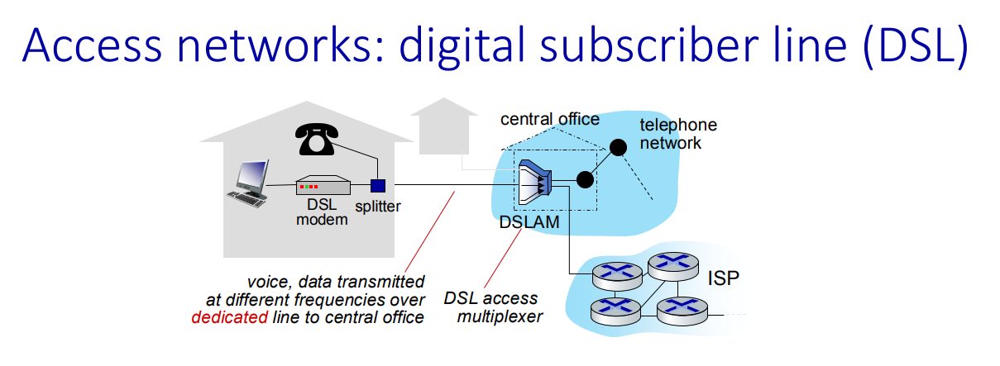

Links: [IIT Hyderabad](IIT%20Hyderabad.md), [Computer Networks](../GATE%20Prep/Computer%20Networks.md)

Resources: [CN: Top Down Approach](https://gaia.cs.umass.edu/kurose_ross/online_lectures.htm)

# ACN - 01

- Language we are going to use C, [Cpp](../Cpp/Cpp.md), [Python](../Python/Python.md)
- Tools: Wireshark tool, NS-3 tool (Recommended Linux)
- TCP/IP Model on focus.
## Resources

- [Google Classroom]([CS5060: Advanced Computer Networks (Aug 2024) (google.com)](https://classroom.google.com/u/0/c/NjkxNjk0OTAyNDE0))
- [Slides of Lecture](https://drive.google.com/file/d/1CoNdo1VjZmc_0a0Q0sCCcin_x2lY8Ulx/view?usp=classroom_web&authuser=0)
## Syllabus

1. Basics of CN & Network
2. Application Layer
3. Transport Layer principles & protocols
4. Network Layer: Data Plane
5. Network Layer: Control Plane
6. Link Layer & LAN's

# ACN - 02

## Network Edge

### Component

- All **Devices:** such as 'Mobile, Camera, PC' that are connected at end of Network. 
- **Equipment:** Routers, switches, access points. 
- **Function:** Facilitates the entry and exit of data to and from the network, connecting end-users to the network core.
### Edge Computing

**Edge Computing** is a distributed computing paradigm where data processing and storage occur closer to the data source (Mini Processing Devices) or end-users rather than in a centralized data center. It can help to complete the small tasks which require real time changes, Later on that data can be sent to the cloud for later on usage.

**Key Points:**

- **Reduces Latency:** By processing data locally, it minimizes the delay caused by transmitting data to distant servers.
- **Improves Performance:** Enhances the speed and efficiency of applications, especially for real-time data processing.
- **Increases Reliability:** Reduces dependency on central servers, improving resilience to network outages.
- **Use Cases:** IoT devices, autonomous vehicles, smart cities, and remote monitoring systems.

## Packet Switching

**Packet Switching** is a method of data transmission where data is broken into small packets and sent independently over a network. 

**Key Points:**
- **Data Division:** Large messages are divided into smaller packets.
- **Routing:** Packets are sent via different paths and reassembled at the destination.
- **Efficiency:** Utilizes network resources more efficiently and handles variable traffic loads.
- **Reliability:** Ensures data delivery even if some packets are lost or delayed, with retransmission mechanisms.
### Types of Delays in Packet Switching

**Packet Delay** refers to the time it takes for a data packet to travel from its source to its destination in a network. It includes several components:

1. **Transmission Delay:** Time required to push the packet's bits into the transmission medium.
	- In the context of `packet delay`, **L / R** represents a simplified formula to calculate the transmission delay:
		- **L**: Packet Length (in bits)
		- **R**: Transmission Rate (in bits per second or bps)
			- **Transmission Delay Formula:**
				$$ Transmission Delay = \frac{L}{R} $$
				> This formula calculates the time it takes to push the entire packet of length **L** into the network link with a rate of **R** bits per second. For example, if a packet is 1,000,000 bits long and the transmission rate is 1,000,000 bps, the transmission delay would be 1 second.
				> 
2. **Propagation Delay:** Time for a packet to travel through the physical medium (e.g., cables, fiber optics).
3. **Queuing Delay:** Time a packet spends waiting in queue at network devices (e.g., routers, switches) before being processed.
4. **Processing Delay:** Time needed for routers or switches to process the packet's header and routing information.

Total packet delay is the sum of these delays and affects overall network performance and user experience.

## Services & Protocols of Internet

- `Protocol` define the format, order of message sent/received among network entities & action it tool on message transmission receipt
- **Duplex** refers to the mode of communication in a network:
	- **Simplex:** One-way communication (e.g., radio broadcasts).
	- **Half-Duplex:** Two-way communication, but not simultaneous (e.g., walkie-talkies).
	- **Full-Duplex:** Two-way communication, simultaneous (e.g., telephone conversations).

### **Internet Services:**

1. **Web Browsing:** Access and view web pages.
2. **Email:** Send and receive electronic mail.
3. **File Sharing:** Transfer files between systems.
4. **Domain Name Resolution:** Convert domain names to IP addresses.
5. **Remote Access:** Access and control systems from a distance.
6. **Streaming Media:** Deliver audio and video content in real-time.

### **Internet Protocols:**

1. **HTTP/HTTPS:** Protocols for web page transfer; HTTPS includes encryption.
2. **SMTP:** Protocol for sending emails.
3. **POP3/IMAP:** Protocols for retrieving and managing emails.
4. **FTP/SFTP:** Protocols for file transfer; SFTP includes encryption.
5. **DNS:** Protocol for resolving domain names to IP addresses.
6. **Telnet/SSH:** Protocols for remote system access; SSH is secure.
7. **RTSP/RTP:** Protocols for streaming media delivery.

## Physical Layer Devices Types:

1. **Twisted Pair Cables:**
   - **Types:** Unshielded Twisted Pair (UTP), Shielded Twisted Pair (STP).
   - **Usage:** Common in Ethernet networks.
   - **Example:** Cat5e, Cat6 cables.

2. **Coaxial Cables:**
   - **Usage:** Used for cable TV and older Ethernet networks.
   - **Example:** RG-6, RG-59 cables.

3. **Fiber Optic Cables:**
   - **Types:** Single-mode, Multi-mode.
   - **Usage:** High-speed, long-distance data transmission.
   - **Example:** OM3, OM4 cables for multi-mode; OS1, OS2 cables for single-mode.

4. **Wireless Media:**
   - **Types:** Radio Waves, Infrared.
   - **Usage:** Wi-Fi, Bluetooth, satellite communication.
   - **Example:** Wi-Fi routers, Bluetooth devices, satellite dishes.

5. **Serial and Parallel Ports:**
   - **Usage:** Older interfaces for connecting peripherals.
   - **Example:** RS-232 serial ports, IEEE 1284 parallel ports.

6. **Satellites:**
   - **Usage:** Provide communication over long distances, including global and remote areas.
   - **Example:** Communication satellites for TV broadcasting and Internet services.

7. **Wireless Radios:**
   - **Usage:** Facilitate wireless communication over short and long distances.
   - **Example:** Wi-Fi routers, cellular base stations.

## Shannon Capacity Theorem:

**Shannon's Theorem** (Shannon-Hartley Theorem) relates to the maximum data rate of a communication channel. It defines the theoretical upper limit of data transmission capacity, given the channel's bandwidth and signal-to-noise ratio.

**Formula:**

$$[C = B \log_2 \left(1 + \frac{S}{N}\right) ]$$

**Where:**
- **C** = Channel capacity (in bits per second)
- **B** = Bandwidth of the channel (in hertz)
- **S/N** = Signal-to-noise ratio (power ratio)

**Key Points:**
- **Channel Capacity (C):** Maximum data rate that can be transmitted over the channel with no errors.
- **Bandwidth (B):** Range of frequencies available for transmission.
- **Signal-to-Noise Ratio (S/N):** Ratio of signal power to noise power, affecting the clarity of the signal.

Shannon's Theorem provides the foundation for understanding and optimizing communication systems.

## Extra

- Physical Layer also use electromagnetic waves same as wireless network & Optical fiber uses light pulses.
- `Internet Standard` Set by:
	- RFC: Request for Comment
	- IETF: Internet Engineering Task Force

# ACN - 03

## Resources:
https://classroom.google.com/u/3/c/NjkxNjk0OTAyNDE0

## Physical Link Media:

- BW = f2 (Max Range) - f1 (Min Range)
## Access Network: Digital Subscriber Line (DSL)

- Telephone require point to point connection dedicated line to central office.

- ADSL : Async Digital Subscriber Line
	- One Line Holds Voice (B1), Up Link (B2), Down Link(B3)
	- 