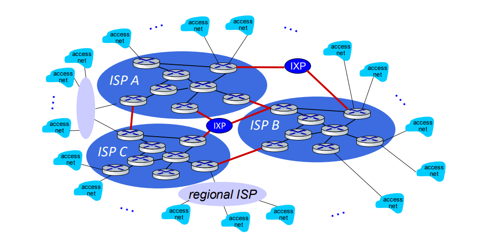
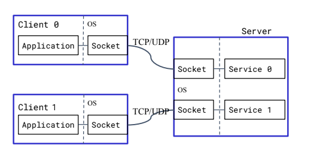

Links: [IIT Hyderabad](IIT%20Hyderabad.md), [Computer Networks](../GATE%20Prep/Computer%20Networks.md)

Resources: [CN: Top Down Approach](https://gaia.cs.umass.edu/kurose_ross/online_lectures.htm)

# ACN - 01

- Language we are going to use C, [Cpp](../Cpp/Cpp.md), [Python](../Python/Python.md)
- Tools: Wireshark tool, NS-3 tool (Recommended Linux)
- TCP/IP Model on focus.
## Resources

- [Google Classroom]([CS5060: Advanced Computer Networks (Aug 2024) (google.com)](https://classroom.google.com/u/0/c/NjkxNjk0OTAyNDE0))
- [Slides of Lecture](https://drive.google.com/file/d/1CoNdo1VjZmc_0a0Q0sCCcin_x2lY8Ulx/view?usp=classroom_web&authuser=0)
## Syllabus

1. Basics of CN & Network
2. Application Layer
3. Transport Layer principles & protocols
4. Network Layer: Data Plane
5. Network Layer: Control Plane
6. Link Layer & LAN's

# ACN - 02

## Network Edge

### Component

- All **Devices:** such as 'Mobile, Camera, PC' that are connected at end of Network. 
- **Equipment:** Routers, switches, access points. 
- **Function:** Facilitates the entry and exit of data to and from the network, connecting end-users to the network core.
### Edge Computing

**Edge Computing** is a distributed computing paradigm where data processing and storage occur closer to the data source (Mini Processing Devices) or end-users rather than in a centralized data center. It can help to complete the small tasks which require real time changes, Later on that data can be sent to the cloud for later on usage.

**Key Points:**

- **Reduces Latency:** By processing data locally, it minimizes the delay caused by transmitting data to distant servers.
- **Improves Performance:** Enhances the speed and efficiency of applications, especially for real-time data processing.
- **Increases Reliability:** Reduces dependency on central servers, improving resilience to network outages.
- **Use Cases:** IoT devices, autonomous vehicles, smart cities, and remote monitoring systems.

## Packet Switching

**Packet Switching** is a method of data transmission where data is broken into small packets and sent independently over a network. 

**Key Points:**
- **Data Division:** Large messages are divided into smaller packets.
- **Routing:** Packets are sent via different paths and reassembled at the destination.
- **Efficiency:** Utilizes network resources more efficiently and handles variable traffic loads.
- **Reliability:** Ensures data delivery even if some packets are lost or delayed, with retransmission mechanisms.
### Types of Delays in Packet Switching

**Packet Delay** refers to the time it takes for a data packet to travel from its source to its destination in a network. It includes several components:

1. **Transmission Delay:** Time required to push the packet's bits into the transmission medium.
	- In the context of `packet delay`, **L / R** represents a simplified formula to calculate the transmission delay:
		- **L**: Packet Length (in bits)
		- **R**: Transmission Rate (in bits per second or bps)
			- **Transmission Delay Formula:**
				$$ Transmission Delay = \frac{L}{R} $$
				> This formula calculates the time it takes to push the entire packet of length **L** into the network link with a rate of **R** bits per second. For example, if a packet is 1,000,000 bits long and the transmission rate is 1,000,000 bps, the transmission delay would be 1 second.
				> 
2. **Propagation Delay:** Time for a packet to travel through the physical medium (e.g., cables, fiber optics).
3. **Queuing Delay:** Time a packet spends waiting in queue at network devices (e.g., routers, switches) before being processed.
4. **Processing Delay:** Time needed for routers or switches to process the packet's header and routing information.

Total packet delay is the sum of these delays and affects overall network performance and user experience.

## Services & Protocols of Internet

- `Protocol` define the format, order of message sent/received among network entities & action it tool on message transmission receipt
- **Duplex** refers to the mode of communication in a network:
	- **Simplex:** One-way communication (e.g., radio broadcasts).
	- **Half-Duplex:** Two-way communication, but not simultaneous (e.g., walkie-talkies).
	- **Full-Duplex:** Two-way communication, simultaneous (e.g., telephone conversations).

### **Internet Services:**

1. **Web Browsing:** Access and view web pages.
2. **Email:** Send and receive electronic mail.
3. **File Sharing:** Transfer files between systems.
4. **Domain Name Resolution:** Convert domain names to IP addresses.
5. **Remote Access:** Access and control systems from a distance.
6. **Streaming Media:** Deliver audio and video content in real-time.

### **Internet Protocols:**

1. **HTTP/HTTPS:** Protocols for web page transfer; HTTPS includes encryption.
2. **SMTP:** Protocol for sending emails.
3. **POP3/IMAP:** Protocols for retrieving and managing emails.
4. **FTP/SFTP:** Protocols for file transfer; SFTP includes encryption.
5. **DNS:** Protocol for resolving domain names to IP addresses.
6. **Telnet/SSH:** Protocols for remote system access; SSH is secure.
7. **RTSP/RTP:** Protocols for streaming media delivery.

## Physical Layer Devices Types:

1. **Twisted Pair Cables:**
   - **Types:** Unshielded Twisted Pair (UTP), Shielded Twisted Pair (STP).
   - **Usage:** Common in Ethernet networks.
   - **Example:** Cat5e, Cat6 cables.

2. **Coaxial Cables:**
   - **Usage:** Used for cable TV and older Ethernet networks.
   - **Example:** RG-6, RG-59 cables.

3. **Fiber Optic Cables:**
   - **Types:** Single-mode, Multi-mode.
   - **Usage:** High-speed, long-distance data transmission.
   - **Example:** OM3, OM4 cables for multi-mode; OS1, OS2 cables for single-mode.

4. **Wireless Media:**
   - **Types:** Radio Waves, Infrared.
   - **Usage:** Wi-Fi, Bluetooth, satellite communication.
   - **Example:** Wi-Fi routers, Bluetooth devices, satellite dishes.

5. **Serial and Parallel Ports:**
   - **Usage:** Older interfaces for connecting peripherals.
   - **Example:** RS-232 serial ports, IEEE 1284 parallel ports.

6. **Satellites:**
   - **Usage:** Provide communication over long distances, including global and remote areas.
   - **Example:** Communication satellites for TV broadcasting and Internet services.

7. **Wireless Radios:**
   - **Usage:** Facilitate wireless communication over short and long distances.
   - **Example:** Wi-Fi routers, cellular base stations.

## Shannon Capacity Theorem:

**Shannon's Theorem** (Shannon-Hartley Theorem) relates to the maximum data rate of a communication channel. It defines the theoretical upper limit of data transmission capacity, given the channel's bandwidth and signal-to-noise ratio.

**Formula:**

$$[C = B \log_2 \left(1 + \frac{S}{N}\right) ]$$

**Where:**
- **C** = Channel capacity (in bits per second)
- **B** = Bandwidth of the channel (in hertz)
- **S/N** = Signal-to-noise ratio (power ratio)

**Key Points:**
- **Channel Capacity (C):** Maximum data rate that can be transmitted over the channel with no errors.
- **Bandwidth (B):** Range of frequencies available for transmission.
- **Signal-to-Noise Ratio (S/N):** Ratio of signal power to noise power, affecting the clarity of the signal.

Shannon's Theorem provides the foundation for understanding and optimizing communication systems.

## Extra

- Physical Layer also use electromagnetic waves same as wireless network & Optical fiber uses light pulses.
- `Internet Standard` Set by:
	- RFC: Request for Comment
	- IETF: Internet Engineering Task Force

# ACN - 03

## Resources:
https://classroom.google.com/u/3/c/NjkxNjk0OTAyNDE0

## Physical Link Media:


- BW = f2 (Max Range) - f1 (Min Range)
## Access Network: Digital Subscriber Line (DSL)

- Telephone require point to point connection dedicated line to central office.
- In Below connection user can only use Either Internet or Telephone at one time. User can't use both at same time.

- ADSL : Async Digital Subscriber Line
	- One Line Holds Voice (B1), Up Link (B2), Down Link(B3)
	- Total Bandwidth B=B1+B2+B3. (B1= Voice require very less data(10 to 16 kbps) so we can also neglect it)
	- Generally Down link Bandwidth is set to be higher because majority or time we only download from internet.
- frequency division multiplexing (FDM) (Hybrid Cable): different TV channels & data transmitted in different frequency bands on the shared coaxial cable

- **Access Network Wireless/WiFi**: Provides wireless connectivity for devices, commonly used in homes, offices, and public spaces.
- **Access Network Homes (FTTH)**: Fiber-to-the-Home (FTTH) delivers high-speed internet via optical fiber directly to residences.
- **Access Network Enterprises (Wired/Wireless)**: Enterprises may use a mix of wired connections (Ethernet) for stability and wireless networks (WiFi/WLAN) for flexibility.
- **Access Network Data Centers**: Typically rely on high-speed, wired connections for data transfer and management.
- **Access Network Satellites**: Used for internet access in remote or rural areas, and for global communication networks, offering connectivity where traditional infrastructure is unavailable.

##  Network speed

**Ethernet:**
- **10BASE-T:** 10 Mbps
- **100BASE-TX:** 100 Mbps
- **1000BASE-T:** 1 Gbps
- **10GBASE-T:** 10 Gbps
- **25GBASE-T:** 25 Gbps
- **40GBASE-T:** 40 Gbps

**Wi-Fi:**
- **Wi-Fi 1 (802.11b):** Up to 11 Mbps
- **Wi-Fi 2 (802.11a):** Up to 54 Mbps
- **Wi-Fi 3 (802.11g):** Up to 54 Mbps
- **Wi-Fi 4 (802.11n):** Up to 600 Mbps
- **Wi-Fi 5 (802.11ac):** Up to 3.5 Gbps
- **Wi-Fi 6 (802.11ax):** Up to 9.6 Gbps
- **Wi-Fi 7 (802.11be):** Up to 30 Gbps

# ACN - 04

## Network Core:
- mesh of interconnected routers
- packet-switching: hosts break application-layer messages into packets
- network forwards packets from one router to the next, across links on path from source to destination
- Two main Function of Network Core are:
	- Forwarding: (Switching) Moving router packet to appropriate router point.
	- Routing: Determines source & Destination path which will be taken by packets.


## Packet Switching
Packet Switching have two different types: 
> L = Length of Packet
> R = Speed of Transfer bits/sec
> D = Distance
> S = Speed of Light
1. Store & Forward Switching:
   Entire Packet must be travelled to next router before transferring the next packet, it will wait till complete packet transfer. Solved E.g. in Notebook.
   $$\frac{L}{R}+\frac{D}{S}$$
2. Cut-Through Switching (Pass Through): 
   Router starts transmitting to destination & do not wait to receive complete packet.
   $$\frac{1}{R}+\frac{D}{S}$$
   > L=1, because it send 1-bit without waiting that's why it's fast, but it's used in very specific networks (Enterprises), because there can be in between packet loss but will not be verified & it require network to work at similar speed because if not switch will struggle to handle the data.
   
   
## Circuit Switching

**Definition**: Circuit switching is a method of communication where a dedicated communication path or circuit is established between the source and the destination for the duration of the communication session.

**Key Features**:
- **Dedicated Path**: A fixed path is reserved exclusively for the entire communication session.
- **Phases**:
  1. **Setup Phase**: The circuit is established before data transmission begins.
  2. **Data Transfer Phase**: Data is transmitted through the reserved circuit.
  3. **Teardown Phase**: The circuit is released once the communication is complete.
- **Example**: Traditional telephone networks, where a call sets up a dedicated line between the caller and the receiver.

**Advantages**:
- **Guaranteed Bandwidth**: The circuit provides a consistent and guaranteed bandwidth.
- **Low Latency**: Minimal delay once the circuit is established.

**Disadvantages**:
- **Inefficient Use of Resources**: The dedicated path remains reserved even if no data is being transmitted, leading to potential wastage.
- **Setup Time**: Time is required to establish the circuit before data transmission can begin.

# ACN - 05

## Packet Switching vs. Circuit Switching

#### **Packet Switching**
- **How it Works**: Data is broken into small packets that are sent independently over the network. Each packet can take a different path to the destination, where they are reassembled.
- **Flexibility**: Efficient use of network resources since the same paths can be shared by multiple connections.
- **Example**: The Internet (e.g., emails, web browsing).

**Benefits:**
- **Efficient Resource Utilization**: Multiple users can share the same network paths, making better use of available bandwidth.
- **Scalability**: Easily accommodates a large number of users and data transmissions.
- **Robustness**: If one path fails, packets can be rerouted through alternative paths, making the network more resilient to failures.
- **Cost-Effective**: No need for dedicated lines, reducing infrastructure costs.

**Disadvantages:**
- **Potential for Delay**: Packets can take different routes and may arrive out of order, causing potential delays and the need for reassembly.
- **Variable Latency**: Since packets may follow different paths, the time they take to reach the destination can vary.
- **Complexity**: Requires sophisticated protocols to handle packet routing, reassembly, and error checking.

#### **Circuit Switching**
- **How it Works**: A dedicated communication path (circuit) is established between the source and destination for the entire duration of the communication session.
- **Reliability**: Provides consistent and reliable communication with guaranteed bandwidth, but can be inefficient since the circuit is reserved even if no data is being sent.
- **Example**: Traditional telephone networks.

**Benefits:**
- **Consistent Performance**: Provides a guaranteed, dedicated bandwidth with predictable latency, making it ideal for real-time communication (e.g., voice calls).
- **Reliability**: Once the circuit is established, the connection is stable and secure throughout the communication session.
- **Low Latency**: Since the path is dedicated, data is transmitted without delays or interruptions.

**Disadvantages:**
- **Inefficient Resource Utilization**: The dedicated circuit remains reserved even when no data is being transmitted, leading to potential wastage of network resources.
- **Setup Time**: Establishing the circuit can take time, leading to delays before communication begins.
- **Cost**: Requires dedicated infrastructure and maintenance, which can be expensive compared to packet-switched networks.

## Circuit Switching Types:

- Frequency Division Multiplexing & Time Division Multiplexing


### Problem & Solution:


- It shows that in packet Switching performs much better then circuit switching in such cases.
### Binomial Distribution Overview

**Definition**: The binomial distribution models the number of successes in a fixed number of independent trials, where each trial has two possible outcomes: success (with probability p) and failure (with probability 1−p).

**Key Parameters**:

- n: Number of trials.
- P: Probability of success on each trial.
- r: Random variable representing the number of successes in n trials.

**Probability Mass Function (PMF)**:

$$P(X=r)=(^nCr)p^r(1−p)^{(n−r)}$$

Where:

- (nCr) is the binomial coefficient, representing the number of ways to choose r successes from n trials.
- r is the number of successes (where 0≤r≤n).

## Why Packet Sharing:

- Resource Sharing so High Users can use simultaneously.
- Simpler and No High Presetup.
- Excessive Congestion Possible (Packet Delay, Packet loss due to buffer overflow, so need protocols for reliability(Congestion Control))

# ACN - 06

## 1. Internet Structure: Network of Networks

- The Internet is a **"network of networks"** where multiple networks interconnect.
- Each network is owned and operated by different organizations (e.g., ISPs, enterprises, universities).
- Networks are organized hierarchically, with access ISPs, regional ISPs, and global transit ISPs.
- **Hybrid Topologies** can be created by connecting access ISPs to global transit ISPs.



### Example of Hybrid Topologies
- **Hybrid Topology**: A combination of different network topologies (e.g., star, mesh, bus) to optimize performance and scalability.
  - **Example**: Connecting each Access ISP to a Global Transit ISP.

## 2. Network Typologies (Network Structure)

- **Network Topology**: The structure/layout of how nodes (e.g., computers, routers) are interconnected in a network.

  - **Types**:
    - **Bus**: All devices share a common communication line.
    - **Star**: All devices are connected to a central hub.
    - **Ring**: Devices are connected in a circular fashion.
    - **Mesh**: Devices are interconnected, providing multiple paths for data.
    - **Hybrid**: A combination of two or more topologies.

## 3. Packet Queue: Delay in Packets

- **Packet Queue**: Packets waiting in line to be processed by a router or network device.
  - **Delay** occurs when packets are waiting due to **congestion** in the queue.
  - **Types of Delays**:
    - **Processing Delay (d_process)**: Time to examine the packet header and determine where to direct the packet.
    - **Queueing Delay (d_queue)**: Time the packet spends waiting in the queue before it can be processed.
    - **Transmission Delay (d_tran)**: Time required to push all of the packet's bits onto the wire.
    - **Propagation Delay (d_prop)**: Time it takes for the signal to propagate from one end of the medium to the other.

### Total Delay (d_total)
$$[
d_{\text{total}} = d_{\text{process}} + d_{\text{queue}} + d_{\text{tran}} + d_{\text{prop}}
]$$

## 4. Total Loss Occurrence

- **Total Loss Occurrence**: The rate at which packets are lost due to congestion.
  - **Formula**: 
    $$
    \frac{L \cdot a}{R} 
    $$
    - **L**: Number of bits in the packet.
    - **a**: Arrival rate of bits to the queue (bits/sec).
    - **R**: Service rate of bits by the router or network device (bits/sec).

#### Service Requirements


# ACN - 07

## Packet Queue Delay


### Scenario 1: Packets Arrive Simultaneously
- **Time (t = t1):** All 5 packets arrive at the same time (Inter-Arrival Time, IAT = 0).
- **Consequence:** Every subsequent packet has to wait for the previous ones to be transmitted.
  - **Wait Time:** Each packet after the first has to wait ((n-1){L} / {R}) for its turn to be transmitted.
  $$\frac{[n-1]L}{R}$$

### Scenario 2: Packets Arrive Late
- **Time (t = t2):** All 5 packets arrive with a delay (IAT > Transmission Delay).
- **Consequence:** Depending on the delay, packets may experience reduced waiting time or none at all if the link is idle.

### Queue Dynamics
- If packets queue in router buffers, they wait their turn for transmission.
  - **Queue Length Growth:** Occurs when the arrival rate to the link temporarily exceeds the output link capacity.
  - **Packet Loss:** Happens when the memory allocated for queued packets is full, leading to packet drops.

## Real Internet Delay & Routes

### Traceroute Program
- **Function:** Provides delay measurement from the source to the destination.
- **Types of Packets Supported:** TCP, UDP, ICMP.
- **Time to Live (TTL):** Default is set to 64.

### Packet Loss Scenarios
- **TTL Expiration:**
  - **Option 1:** Router replies by creating a "Time Exceeded" error; the result is visible as `***`.
  - **Option 2:** Router does not reply if set by the router's policy.

- **Buffer Size Limit Exceeded:**
  - **Cause:** Packet loss can occur if the buffer size limit is exceeded, leading to a full queue.
  - **Consequence:** Dropped or lost packets during transmission.

### Key Points
- Packet delays can occur due to congestion in queues.
- Packet loss can be caused by buffer overflow or TTL expiration.
- Traceroute helps diagnose delay and packet loss issues in a network.

# ACN - 08

## Throughput

- **Throughput**: The rate at which bits are being sent from the sender to the receiver.
  - **Instantaneous Throughput**: The rate at a given point in time.
  - **Average Throughput**: The rate over a longer period of time.

### Throughput Calculation
- **Formula**:
$$[
  \text{Throughput (Tput)} = \frac{\text{Message Size (M)}}{\text{Message Delay (D)}} = \frac{M}{\text{Transmission Delay} + \text{Propagation Delay}}
  ]$$
- **Result**:
$$  [
  \text{Tput} = R_c \text{ (Rate after calculation)}
  ]$$
  
- **Bottlenecks**: The throughput is often limited by the slower of the two rates:

  - **R_client**: Rate of the client.
  - **R_server**: Rate of the server.

## Delay × Bandwidth Product

- **Concept**: The link between a pair of nodes can be visualized as a hollow pipe.
  - **Latency**: The length of the pipe (time delay).
  - **Bandwidth**: The width of the pipe (amount of data that can be transmitted per unit time).


### Key Points
- **Delay × Bandwidth Product**: 
  - **Meaning**: It indicates how many bits the sender must transmit before the first bit arrives at the receiver if the sender wants to keep the pipe full.
  - **Response Time**: Takes another one-way latency to receive a response (ACK) from the receiver.
  - **Utilization**: If the sender does not send a full delay × bandwidth product’s worth of data before waiting for an ACK, the network’s capacity will not be fully utilized.

### Layering TCP


# ACN - 09

## Services, Layering, and Encapsulation in TCP/IP

### 1. Application Layer
- **Function**: The application layer exchanges messages to implement a specific application service.
- **Interaction**: Uses the services provided by the transport layer to facilitate communication.

### 2. Transport Layer
- **Function**: Transfers the message (M) from one process to another.
  - **Reliability**: Ensures reliable transfer of data (e.g., TCP).
- **Interaction**: Uses the services provided by the network layer to move data between processes on different hosts.

### 3. Network Layer
- **Function**: Transfers the transport-layer segment \([Ht | M]\) from one host to another.
- **Interaction**: Utilizes the link layer services to facilitate host-to-host communication.

### 4. Link Layer
- **Function**: Transfers the datagram \([Hn| [Ht |M]]\) from a host to a neighboring router.
- **Interaction**: Uses the services of the physical layer to transmit data between devices.

### 5. Physical Layer
- **Function**: Provides the physical means of transmitting raw bits over a communication link.


## Encapsulation

- **Concept**: Each layer adds its own header information (H) to the data received from the layer above before passing it to the layer below.
- **Process**:
  1. **Message (M)**: Application data.
  2. **Segment**: Transport layer encapsulates the message into a segment with a transport header ([Ht | M]).
  3. **Datagram**: Network layer encapsulates the segment into a datagram with a network header ([Hn| [Ht | M]]).
  4. **Frame**: Link layer encapsulates the datagram into a frame for transmission.


- **Matryoshka Dolls**: Encapsulation is like stacking Matryoshka dolls, where each layer adds its own information, wrapping the previous layer's data.

### Summary of Encapsulation Terms
- **Message**: Data at the application layer.
- **Segment**: Data at the transport layer.
- **Datagram**: Data at the network layer.
- **Frame**: Data at the link layer.

# ACN - 10

## What is a Socket?

- A **socket** is an API (Application Programming Interface) that allows networking applications to use the services of the transport layer.
- It acts like a pipe, providing communication between the transport layers of two hosts within a network.


### Key Characteristics of Sockets:
- **API between application and transport layers:**
  - **Berkeley sockets interface**: Originally provided by BSD 4.1 around 1982.
- **Socket Operations:**
  - **Creating a socket**: Initialize a socket for communication.
  - **Binding the socket**: Attach the socket to a network (e.g., bind to an IP address and port).
  - **Sending/receiving data**: Use the socket to transmit or receive data between hosts.
  - **Closing the socket**: Properly terminate the communication by closing the socket.

## Socket Programming

### Goal:
- The primary goal of socket programming is to learn how to build client/server applications that communicate using sockets.

### Definition:
- A **socket** is a door or interface between an application process and the end-to-end transport protocol (TCP/UDP).

### Types of Sockets:
- **UDP Sockets**: 
  - Unreliable, datagram-based communication.
- **TCP Sockets**: 
  - Reliable, byte stream-oriented communication.

## Application Example

### Example: Simple Client/Server Communication

1. **Client**:
   - Reads a line of characters (data) from its keyboard.
   - Sends the data to the server.
   
2. **Server**:
   - Receives the data from the client.
   - Converts the characters to uppercase.
   - Sends the modified data back to the client.
   
3. **Client**:
   - Receives the modified data from the server.
   - Displays the modified line on its screen.

### Example in Python:

#### Server Code:
```python
import socket

# Create a TCP socket
server_socket = socket.socket(socket.AF_INET, socket.SOCK_STREAM)

# Bind the socket to an IP address and port
server_socket.bind(('localhost', 12345))

# Listen for incoming connections
server_socket.listen(1)
print("Server is listening...")

# Accept a connection
connection, address = server_socket.accept()
print(f"Connection from {address} has been established!")

# Receive data from the client
data = connection.recv(1024).decode('utf-8')
print(f"Received data: {data}")

# Convert data to uppercase
modified_data = data.upper()

# Send modified data back to the client
connection.send(modified_data.encode('utf-8'))

# Close the connection
connection.close()
```

#### Client Code:
```python
import socket

# Create a TCP socket
client_socket = socket.socket(socket.AF_INET, socket.SOCK_STREAM)

# Connect to the server
client_socket.connect(('localhost', 12345))

# Read a line of data from the keyboard
data = input("Enter a line of text: ")

# Send the data to the server
client_socket.send(data.encode('utf-8'))

# Receive the modified data from the server
modified_data = client_socket.recv(1024).decode('utf-8')
print(f"Modified data from server: {modified_data}")

# Close the socket
client_socket.close()
```

### Example in C++:

#### Server Code:
```cpp
#include <iostream>
#include <cstring>
#include <sys/socket.h>
#include <netinet/in.h>
#include <unistd.h>

int main() {
    int server_socket = socket(AF_INET, SOCK_STREAM, 0);

    sockaddr_in server_addr;
    server_addr.sin_family = AF_INET;
    server_addr.sin_port = htons(12345);
    server_addr.sin_addr.s_addr = INADDR_ANY;

    bind(server_socket, (sockaddr*)&server_addr, sizeof(server_addr));

    listen(server_socket, 1);
    std::cout << "Server is listening..." << std::endl;

    int client_socket = accept(server_socket, nullptr, nullptr);
    
    char buffer[1024];
    memset(buffer, 0, sizeof(buffer));
    
    read(client_socket, buffer, sizeof(buffer));
    std::cout << "Received data: " << buffer << std::endl;

    // Convert to uppercase
    for(int i = 0; buffer[i]; i++) {
        buffer[i] = toupper(buffer[i]);
    }

    send(client_socket, buffer, strlen(buffer), 0);

    close(client_socket);
    close(server_socket);

    return 0;
}
```

#### Client Code:
```cpp
#include <iostream>
#include <cstring>
#include <sys/socket.h>
#include <arpa/inet.h>
#include <unistd.h>

int main() {
    int client_socket = socket(AF_INET, SOCK_STREAM, 0);

    sockaddr_in server_addr;
    server_addr.sin_family = AF_INET;
    server_addr.sin_port = htons(12345);
    inet_pton(AF_INET, "127.0.0.1", &server_addr.sin_addr);

    connect(client_socket, (sockaddr*)&server_addr, sizeof(server_addr));

    std::string data;
    std::cout << "Enter a line of text: ";
    std::getline(std::cin, data);

    send(client_socket, data.c_str(), data.size(), 0);

    char buffer[1024];
    memset(buffer, 0, sizeof(buffer));

    read(client_socket, buffer, sizeof(buffer));
    std::cout << "Modified data from server: " << buffer << std::endl;

    close(client_socket);

    return 0;
}
```

# ACN - 11

## 1. Persistent HTTP

### Overview
- **Persistent HTTP** is the modern version of HTTP that allows the same TCP connection to be reused for multiple requests and responses.
- Earlier HTTP versions (like HTTP/1.0) closed the connection after each request, requiring a new TCP connection for every resource.

### Benefits of Persistent HTTP:
- **Reduced Connection Overhead**: Avoids the need to establish a new TCP connection for every file (HTML, images, etc.).
- **Improved Latency**: Since a single connection is used, round-trip times (RTTs) for connection setup are reduced.

### Example Problem:
- A webpage requires **1 HTML file** and **10 image files** to load.
- **No Pipelining (Sequential Requests)**:
  - Each file is requested one by one over a persistent connection, leading to multiple RTTs (request, response cycle).
- **With Pipelining**:
  - Multiple requests are sent without waiting for responses, reducing the delay.

## 2. Pipelining vs Non-pipelining (TCP Delays)

### Non-pipelined Requests (No Pipelining):
- Requests are made sequentially.
- Each subsequent request waits for the previous request's response, leading to high latency, especially over slow or long-distance connections.

### Pipelined Requests (With Pipelining):
- All requests are sent at once (without waiting for previous responses).
- TCP processes the responses in order.
- **Benefits**: Reduced waiting time, faster resource loading, especially noticeable when many small resources (like images) are requested.

## 3. Parallel TCP Sessions

### Overview:
- **Parallel TCP Sessions**: To further improve performance, multiple TCP connections (typically 6) are opened to download different resources concurrently.
- Commonly used to fetch assets (images, CSS, JS) in parallel for faster webpage rendering.

### Benefits:
- Increased throughput, as the browser can request multiple resources at once, utilizing the bandwidth more effectively.

## 4. HTTP/2

### Overview:
- **HTTP/2** is a major revision to HTTP designed to improve web performance, speed, and efficiency.
- It addresses many of the inefficiencies found in HTTP/1.x.

### Key Benefits:
1. **Multiplexing**: Multiple requests and responses can be sent over a single TCP connection, and they do not need to wait for one another. This reduces head-of-line blocking.
2. **Binary Framing**: HTTP/2 uses a binary protocol instead of textual. It splits the communication into **frames**, which improves performance and flexibility.
3. **Header Compression**: HTTP/2 compresses headers, reducing redundant data transmission.
4. **Server Push**: Allows servers to send resources to the client before the client explicitly requests them.

### HTTP/2 Frames vs Packets:
- **Frames**: HTTP/2 communication is divided into small frames, which can be interleaved and prioritized, allowing for more efficient data transmission.
- **Packets**: In traditional HTTP/1.x, packets often carried the entire request or response, leading to inefficiencies.
  
### Benefits of Frames:
- **Improved Packet Loss Recovery**: Since HTTP/2 divides data into frames, if a packet containing a frame is lost, only the missing frame needs to be retransmitted. This results in faster recovery and fewer delays compared to HTTP/1.x, where the loss of a packet could block the entire stream.

## 5. Web Performance Enhancements

### Improvements with HTTP/2:
- **Faster Load Times**: Due to multiplexing, header compression, and server push, web pages load faster.
- **Reduced Latency**: The elimination of head-of-line blocking and frame-based data transfer significantly improves latency, especially over high-latency networks.
- **Better Bandwidth Utilization**: Parallel transfer of resources over a single connection maximizes bandwidth use.

### Web Performance Summary:
- **HTTP/1.x** struggled with high latency and inefficient resource requests.
- **HTTP/2** solves many of these issues, leading to improved overall web performance, especially for modern, resource-heavy websites.

# ACN - 12

## 1. HTTP 1.x Messages

### Types of HTTP Messages
- **Request**: Sent by the client to request resources.
- **Response**: Sent by the server in reply to the request.

### Common HTTP Methods
- **GET**: Retrieves data from the server (e.g., a webpage).
- **POST**: Sends data to the server (e.g., form submission).
- **HEAD**: Similar to GET, but only retrieves headers (no body).
- **PUT**: Updates or uploads a resource to the server.

## 2. HTTP Response Codes
- **200 OK**: The request succeeded.
- **301 Moved Permanently**: The requested resource has been moved to a new URL.
- **304 Not Modified**: Indicates the resource has not been modified since last requested.
- **...**: Other response codes indicate various statuses (e.g., 404 Not Found, 500 Internal Server Error).

## 3. HEX & ASCII Values
- **HEX**: Represents binary data in a base-16 format. Commonly used in programming and networking for clarity.
- **ASCII**: Character encoding standard representing text in computers.
  - Example: The ASCII value of 'A' is 65 in decimal, 41 in hexadecimal.

## 4. HTTP/2.0 Features

### Server Push
- The server can send multiple resources to the client after receiving an HTTP GET request.
- **Considerations**: If objects are large, it can lead to increased delays and resource wastage.

### Multiplexing
- Allows multiple requests and responses to be sent simultaneously over a single connection, reducing latency.
  
### HTTP/2.0 with TLS
- HTTP/2 is often used with TLS (Transport Layer Security) to ensure secure data transmission.
- Enhances performance and security for web communications.

# ACN - 13

## 1. Maintaining User/Server State: Cookies

### HTTP Statelessness
- HTTP is a stateless protocol, meaning it does not retain user state or information across requests.

### HTTP + Cookies = Stateful
- Cookies enable stateful interactions, allowing the server to remember user information.

### Uses of Cookies
- **Authorization**: Verify user identity and grant access to secure areas.
- **Recommendations**: Suggest products or content based on user behavior.
- **Session Management**: Maintain user details during browsing sessions.
- **Shopping Carts**: Track items added to the cart across sessions.

## 2. Advertising Mechanisms

### Real-Time Bidding
- Advertisements on websites often use real-time bidding to display relevant ads.
- Hundreds of tracking scripts (web bugs) access user data each time a website is visited.

### User Tracking
- **Cookies**: Used for tracking user browsing behavior.
  - **First-Party Cookies**: Set by the website being visited.
  - **Third-Party Cookies**: Set by external services (e.g., advertisers) and used for tracking across different sites.
- **Trackers (Web Bugs)**: Small pieces of code that collect user activity data.

## 3. Progressive Loading of Web Pages

### Overview
- **Progressive Loading**: Technique to enhance user experience by rendering content progressively.

### HTTP
- Supports progressive rendering, allowing parts of a webpage to load without waiting for the entire file.

### JS/CSS
- JavaScript and CSS files often require the entire file to be processed, which can delay rendering if large.


# ACN - 14 Tutorial Session

Tutorial with multiple scenarios for Data transfer & retrieval from server.

# ACN - 14

## Privacy Concerns in Computer Networks

### 1. Tracking Browsing Sessions with Cookies
- **Cookies**: Small data files stored on the user's device that track browsing activities.
- **Purpose**: Enable personalized experiences, user authentication, and session management.

### 2. Disabling Trackers
- Users can take steps to disable trackers:
  - **Browser Settings**: Most browsers allow users to block or delete cookies.
  - **Privacy Extensions**: Tools like ad blockers and privacy-focused extensions can prevent trackers from functioning.
  - **Incognito/Private Mode**: Browsers offer private modes that limit cookie storage and tracking.

### 3. Understanding Referrer Data
- **Referrer**: The URL of the webpage that directed a user to the current page.
- **Importance**: 
  - Businesses analyze referrer data to understand traffic sources and optimize marketing strategies.
  - Knowing which sources yield the most engagement helps in refining advertising efforts.

### 4. Blocking Third-Party Cookies
- **Third-Party Cookies**: Set by domains other than the one the user is currently visiting, primarily used for tracking across websites.
- **Blocking Implications**:
  - When users block third-party cookies, they prevent tracking by advertisers and data aggregators.
  - **Important Note**: Blocking these cookies does not stop the data the website collects from the user. First-party data collection continues.

### 5. Broader Privacy Concerns
- **User Data Exploitation**: Collected data can be sold or shared without user consent, leading to privacy breaches.
- **Targeted Advertising**: While personalized ads can improve user experience, they raise concerns about excessive surveillance and data profiling.
- **Legal Frameworks**: Various laws (e.g., GDPR, CCPA) are being implemented to protect user privacy and regulate data collection practices.

### 6. Best Practices for Users
- **Regularly Clear Cookies**: Remove stored cookies periodically to minimize tracking.
- **Use Privacy-Focused Browsers**: Browsers like Brave or Firefox focus on enhancing user privacy.
- **Educate on Privacy Settings**: Understanding browser privacy settings and utilizing them can help protect personal information.

# ACN - 15

## Web Caches and Proxy Servers

### 1. Overview
- **Web Caches**: Temporary storage for web documents (e.g., HTML pages, images) that improves response time and reduces network traffic.
- **DNS Caches**: It stored the DNS information so your don't need to visit Root DNS server for asking the Host IP address.
- **Proxy Servers**: Intermediate servers that handle requests from clients and fetch resources from other servers, often using cached content to satisfy requests.

### 2. Benefits
- **Reduced Latency**: Satisfies client requests faster by serving cached content instead of fetching it from the origin server.
- **Bandwidth Savings**: Decreases the amount of data transferred over the network by reusing cached data.
- **Load Reduction**: Reduces the load on the original server by intercepting requests.

### 3. Cache Control
- **Cache-Control Header**: Used to specify directives for caching mechanisms in both requests and responses.
  - **Examples**:
    - `max-age=<seconds>`: Specifies the maximum amount of time a resource is considered fresh.
    - `no-cache`: Forces caches to submit requests to the origin server for validation before releasing a cached copy.
    - `public` vs. `private`: Determines whether a response is cacheable by shared caches (public) or only by a single user (private).

### 4. Caching Example
- When a client requests a resource, and there is an intermediate router with caching capabilities:
  - **Scenario**: 
    - Client requests a webpage (A).
    - The router checks its cache. If the webpage is cached and still valid, it serves the cached version, reducing the time needed to connect to the actual server.
    - If the webpage is not cached or expired, the router fetches it from the original server, caches it, and serves it to the client.
  - **Time Difference**: 
    - Direct request to the server: 300 ms
    - Cached request through the router: 50 ms

### 5. Types of Web Caches
- **Private Cache**: 
  - Used by a single user (e.g., browser cache). 
  - Stores personal browsing data to speed up access to frequently visited sites.

- **Shared Cache**: 
  - Used by multiple users (e.g., proxy server cache).
  - Reduces the amount of repeated data transmitted over the network for all users.

- **Reverse Proxy Cache**: 
  - Positioned between clients and one or more servers.
  - Caches content from the server and serves it to clients, often used to improve performance and scalability.

### 6. Proxy Types
- **Transparent Proxy**: 
  - Intercepts client requests without modifying them.
  - Does not require any configuration on the client side.
  - Example: A school network using a transparent proxy to filter internet access without user intervention.

- **Forward Proxy**: 
  - Acts on behalf of clients and forwards requests to the original server.
  - Can be used for anonymity, caching, and filtering content.
  - Example: A user accesses the web through a forward proxy to mask their IP address.

### 7. History Capture
- Proxy servers can log requests and responses, providing insights into user behavior and traffic patterns, which can help in optimizing cache strategies.

# ACN - 16

## 1. Digital Personal Data Protection Act-2023
- **Overview**: The act focuses on protecting the personal data of individuals in India, establishing regulations for data processing and storage by organizations.

## 2. Email Services
- **Historical Context**: Email services were among the first applications used on the internet, predating the World Wide Web (WWW).

### 3. Major Components of Email
- **User Agent**: 
  - Client-side software that allows users to send and receive emails (e.g., Outlook, Thunderbird).
  
- **Mail Transfer Agent (MTA)**: 
  - Software that transfers email messages between servers, ensuring delivery from sender to recipient.
  
- **Simple Mail Transfer Protocol (SMTP)**: 
  - Protocol used for sending emails from a client to a server and between servers.

### 4. Email Sending Process
1. **User X** wants to send an email to **User Y**.
2. User X's email client sends the email to their **SMTP server**, which contains a mailbox and queue for outgoing messages.
3. The SMTP server processes the email and forwards it to **User Y's mail server**.
4. The email is then placed in **User Y's mailbox** for retrieval.

### 5. SMTP vs. HTTP
- **SMTP**: 
  - Primarily used for the delivery and storage of email messages to the recipient's server.
  - Supports **MIME** (Multipurpose Internet Mail Extension), allowing emails to include multimedia files (images, PDFs, etc.).

- **HTTP**: 
  - A web-based protocol that interfaces with email protocols like SMTP and IMAP (or POP3) to allow web applications to send and receive emails.

### 6. IMAP and POP3
- **Internet Message Access Protocol (IMAP)**: 
  - Allows users to access and manage their email messages stored on a server.
  - Features include retrieval, deletion, and organization of messages into folders.
  
- **Post Office Protocol (POP3)**: 
  - An older protocol primarily used for retrieving emails from a server, often downloading them to a client and removing them from the server.

### 7. HTTP Interactions
- **Reading Emails**: 
  - Web-based interfaces typically use HTTP to interact with the server to display email content.

- **Sending Emails**: 
  - To send an email, a client connects using SMTP and issues a POST request to the server.

# ACN - 17

## 1. Overview of the Domain Name System (DNS)
- **Definition**: The DNS is often referred to as the "address book of the internet," enabling hostname to IP address translation.
- **Structure**: It is a distributed database implemented in a hierarchy of nameservers.

### 2. Key Characteristics
- **Application Layer Protocol**: Operates at the application layer, facilitating communication over the network edge.
- **Hierarchical Structure**: Organized in a tree-like format, starting from the root zone.

## 3. DNS Components
- **Hostname to IP Address Translation**: Converts user-friendly domain names into machine-readable IP addresses.
- **Mail Server and Web Server**: Both can share the same hostname but may serve different functions.

### 4. DNS Hierarchy
- **Root Zone**: The highest level in the DNS hierarchy.
  - Example: For the domain `www.iith.ac.in.`, the last dot represents the root zone.
- **Top-Level Domain (TLD)**: The next level down in the hierarchy.
  - `.in` is a TLD for India.
  - `.ac` indicates an academic domain.
  
### 5. DNS Query Process
- To resolve an IP address from a hostname, the DNS query typically involves three round-trip times (RTTs):
  1. Query the root server.
  2. Query the TLD server.
  3. Query the authoritative server.

## 6. ICANN (Internet Corporation for Assigned Names and Numbers)
- **Role**: Manages the root server and oversees domain name registration and allocation.
- **Root Servers**: There are approximately 21 root servers globally.

### 7. Types of Top-Level Domains (TLDs)
- **Generic TLDs (gTLD)**: Examples include `.com`, `.edu`, and `.org`.
- **Country Code TLDs (ccTLD)**: Specific to countries (e.g., `.in` for India).
- **Special TLDs**: 
  - `.gov` is reserved for U.S. government sites, while `.gov.in` is used for Indian government sites.

## 8. DNS Security Concerns
- **Risks**: Inaccurate DNS information can lead to phishing attacks and man-in-the-middle attacks.
- **Importance of Security**: Protecting the integrity of DNS is crucial to prevent malicious redirects.

## 9. Local DNS Server and Caching
- **Local DNS Server**: Stores DNS information in cache, which speeds up query responses for frequently accessed domains.
- **Authoritative DNS Server**: When a user visits a site, the local DNS may query the authoritative DNS server for accurate information.

## 10. Additional Concepts
- **DNS Name Resolution**: The process of converting domain names into IP addresses.
- **Content Delivery Network (CDN)**: Uses multiple distributed servers to deliver content more efficiently and improve load distribution.


# ACN - 18

## 1. DNS Query Types
- **Iterated Query**:
  - The DNS server replies to the client with the best information it has. If the server doesn’t know the answer, it will direct the client to another DNS server (e.g., the root server or TLD server).

- **Recursive Query**:
  - The DNS server takes full responsibility for responding to the client’s query. If it doesn’t have the requested IP, it will query other DNS servers on behalf of the client.

## 2. Caching DNS Information
- **DNS Caching**:
  - DNS information is cached at various levels, including local devices and servers, to speed up query resolution.
  - The root nameserver information is often stored in our local device, reducing the need to repeatedly query the root server.

## 3. DNS Records (Resource Records (RR))
- **Format**: Each DNS resource record consists of a name, value, type, and time-to-live (TTL).
  - **A** (Authoritative): Maps a hostname to an IP address.
  - **NS** (Nameserver): Maps a domain name to an authoritative nameserver for that domain.
  - **CNAME** (Canonical Name): Maps an alias (name) to a canonical (real) name. Often used for load balancing (e.g., `server.east` and `server.west` for different geographical servers).
  - **MX** (Mail Exchange): Maps a domain name to the mail server responsible for handling SMTP emails.
  - **SOA** (Start of Authority): Indicates the authoritative DNS server for a domain and provides administrative information.

## 4. DNS Tools
- **Dig Command**:
  - A tool used to query DNS servers and retrieve DNS records. It can display details about root servers and DNS configurations.

## 5. Border Gateway Protocol (BGP)
- **BGP**:
  - The protocol used to exchange routing information between different autonomous systems (AS) on the internet.

## 6. Anycast Routing
- **Anycast**:
  - Multiple servers share the same IP address, and the network automatically routes requests to the nearest or best-performing server.
  - Examples:
    - **Cloudflare Query Resolver**: `1.1.1.1` / `1.0.0.1`
    - **Google DNS Query Resolver**: `8.8.8.8` / `8.8.4.4`

## 7. DNS Security
### 7.1. Security Goals
- **Confidentiality**: Protecting data from unauthorized access (MD5/SHA2 for hashing).
- **Authenticity**: Verifying the source of the data.
- **Integrity**: Ensuring the data hasn’t been tampered with.
  - **Example**: Signing SOA records with `MD5` or `SHA2` to maintain integrity.

### 7.2. Linux Files for DNS Configuration
- **resolv.conf**: Contains the names of DNS servers that the system will query.
- **hosts file**: Stores mappings of IP addresses to hostnames for local and external hosts.

## 8. DNS Attack Types
### 8.1. DDoS (Distributed Denial of Service) Attack
- **Attack Method**: Flood the root DNS servers with traffic to overwhelm them.
- **Defense**: Local DNS servers cache the data, meaning the attack is often mitigated because requests are redirected to cached data, which helps prevent the attack from being fully successful.

### 8.2. Spoofing Attack
- **Method**: Intercepting DNS queries and returning fake, malicious responses to redirect users to bogus websites.
- **DNS Cache Poisoning**: An attacker can insert false DNS entries into a cache, causing future queries to resolve to incorrect IP addresses.
  
### 8.3. DNSSEC (DNS Security Extensions)
- **Purpose**: Provides authenticity and integrity to DNS queries.
- **How It Works**: DNSSEC uses digital signatures to verify the legitimacy of DNS responses. If a message is tampered with, DNSSEC will detect it, ensuring that users are not misled by fake responses.

# ACN - 19

## 1. Overview of the Transport Layer
- The transport layer is responsible for end-to-end communication between processes across a network. 
- It provides logical communication between application processes running on different hosts.
- **Key tasks**:
  - **Multiplexing and Demultiplexing**: Mapping multiple application processes to network connections.
  - **Error Detection and Recovery**: Ensuring data integrity.
  - **Data Segmentation and Reassembly**: Splitting data into segments for transmission and reassembling them at the destination.

---

## 2. Principle Internet Transport Protocols
The Internet primarily uses two transport protocols:
- **TCP (Transmission Control Protocol)**: Reliable, connection-oriented service.
- **UDP (User Datagram Protocol)**: Lightweight, connectionless service.

### Key Differences Between TCP and UDP
| Feature            | TCP                        | UDP                         |
|--------------------|----------------------------|-----------------------------|
| **Connection Type** | Connection-oriented       | Connectionless              |
| **Reliability**     | Ensures reliable delivery (ACKs, retransmissions) | No guarantee of delivery or order |
| **Error Detection** | Detects and recovers from errors | Error detection only (checksum) |
| **Speed**           | Slower due to overhead    | Faster due to minimal overhead |
| **Use Cases**       | File transfer, web browsing (HTTP/HTTPS) | Streaming, DNS queries, gaming |

---

## 3. Multiplexing and Demultiplexing
- **Multiplexing**: Combining multiple application data streams into one transport-layer stream.
- **Demultiplexing**: Extracting and delivering data to the correct application process.
- **Ports**: 
  - Each application process is assigned a **port number** for identification.
  - Even within a single device (e.g., desktop app or browser tab), each process communicates using a unique port.
  - **Single/Two applications on the same port**: Possible only if one uses **TCP** and the other uses **UDP**.

---

## 4. UDP: User Datagram Protocol
- **Characteristics**:
  - Simple, lightweight, and connectionless.
  - Best-effort service: Data may be lost or delivered out of order.
  - No setup required: Suitable for low-latency or constrained networks.
  - Includes a **checksum** for basic error detection.

### Checksum Calculation
1. Add 16-bit words of the segment's data.
2. Wrap around if the sum overflows (i.e., add the overflow bit back into the sum).
3. The result is the **checksum**—used by the receiver to detect errors in the segment.

### Advantages of UDP
- No connection setup needed.
- Minimal overhead, making it faster.
- Can work efficiently in constrained or compressed networks.

### Limitations of UDP
- No guarantee of delivery or order.
- Not suitable for applications requiring reliable data transfer.

---

### Example of Usage
- **UDP in Real Life**:
  - **DNS**: Fast, simple queries where loss can be tolerated.
  - **Streaming**: Audio/video where occasional loss is acceptable.

# ACN - 20

## 1. Principles of Reliable Data Transfer (RDT)
- **Reliable Data Transfer (RDT)** ensures accurate and complete communication of data between sender and receiver, even in the presence of errors or packet loss.
- Reliability mechanisms:
  - **Error detection**: Using checksums.
  - **Acknowledgment (ACK)**: Confirming successful receipt of data.
  - **Retransmission**: Resending data if errors or losses are detected.

---

## 2. Finite State Machine (FSM) for Reliable Data Transfer
- **FSM (Finite State Machine)** is used to specify the behavior of the sender and receiver.
- States define specific actions (e.g., sending data, waiting for acknowledgment).
- State transitions occur based on events (e.g., receiving ACK or timeout).

---

## 3. Reliable Data Transfer Protocols

### **RDT 1.0: Reliable Transfer over Reliable Channels**
- Assumes:
  - No bit errors in transmitted packets.
  - No packet loss.
  - In-order delivery of packets.
- Sender transmits data, and the receiver reliably delivers it to the application.

---

### **RDT 2.0: Reliable Transfer over a Channel with Bit Errors**
- Introduces:
  - **Checksum**: Detects corrupted packets.
  - **Acknowledgment (ACK)**: Confirms receipt of data.
  - **Negative Acknowledgment (NAK)**: Requests retransmission of corrupted data.
- **Procedure**:
  - If receiver detects an error (using checksum), it sends NAK.
  - Sender retransmits the data packet on receiving NAK.

#### **Limitation of RDT 2.0**
- If an ACK or NAK is corrupted, the sender cannot determine the receiver’s state.
- Sender may retransmit data unnecessarily or fail to send new data.

---

### **RDT 2.1: Handling Corrupted ACK/NAK**
- Addresses the limitation of RDT 2.0:
  - Introduces **sequence numbers** to detect duplicate packets.
  - Sequence numbers alternate between 0 and 1 (sufficient for stop-and-wait protocol).
- **Procedure**:
  - Receiver uses sequence numbers to identify duplicate packets.
  - Sender retransmits a packet only if the sequence number indicates it is necessary.
  - If the receiver sends a duplicate ACK (due to a lost or corrupted NAK), the sender assumes the last packet was not received and retransmits.

---

## 4. Stop-and-Wait Protocol
- Sender sends one packet at a time and waits for an acknowledgment (ACK) before sending the next packet.
- Receiver sends:
  - **ACK**: For correct packets.
  - **NAK** or duplicate ACK: For corrupted or missing packets.

### **Advantages of Stop-and-Wait**
- Simple and reliable.
- Sufficient for small-scale, low-latency networks.

---

## 5. NAK-Free Protocol
- Replaces explicit NAKs with duplicate ACKs:
  - **Procedure**:
    - Receiver sends an ACK with the sequence number of the last successfully received packet.
    - If the sender receives a duplicate ACK for the same sequence number, it retransmits the latest packet.
  - **Benefit**:
    - Eliminates the need for NAKs while maintaining reliability.
    - Handles errors and packet loss using sequence numbers and duplicate ACKs.

# ACN - 21

## 1. RDT 3.0: Reliable Transfer Over Lossy Channels
- Extends **RDT 2.1** to handle packet loss and acknowledgment (ACK) loss.
- Introduces:
  - **Timers**: Sender sets a timer for each transmitted packet.
  - **Retransmission**: On timeout, the sender retransmits the packet.

### **Scenarios in RDT 3.0**
1. **No Loss**:
   - Packets and ACKs are delivered without any loss or corruption.
   - Sender efficiently transmits packets and receives ACKs.
2. **ACK Loss**:
   - If an ACK is lost, the sender’s timer expires.
   - Sender retransmits the packet, which is then acknowledged again by the receiver.
3. **Packet Loss**:
   - If a data packet is lost, the receiver does not send an ACK.
   - Sender’s timer expires, and it retransmits the lost packet.
4. **Premature Timeout**:
   - Timer expires before the ACK arrives.
   - Sender retransmits the packet unnecessarily, but the receiver can handle duplicates using sequence numbers.

---

## 2. Performance of RDT 3.0: Stop-and-Wait Protocol
- In **Stop-and-Wait**, the sender sends one packet at a time and waits for an ACK before sending the next packet.
- **Sender Utilization (U)**:
  - Represents the fraction of time the sender is actively sending data.
  - Defined as:
    \[
    U = \frac{L / R}{RTT + L / R}
    \]
    where:
    - \(L\): Packet size in bits.
    - \(R\): Transmission rate (bps).
    - \(RTT\): Round Trip Time between sender and receiver.
  - For large RTT or small \(L/R\), utilization decreases significantly.

---

## 3. Pipelined Reliable Data Transfer
- **Pipelining** allows the sender to transmit multiple packets before receiving ACKs, improving efficiency compared to Stop-and-Wait.
- Two main pipelined protocols:
  - **Go-Back-N (GBN)**
  - **Selective Repeat (SR)**

---

## 4. Go-Back-N Protocol
- **Sender**:
  - Can send up to \(N\) packets (window size) without waiting for an ACK.
  - Maintains a **window** of unacknowledged packets.
  - If a packet is lost, the sender retransmits that packet and all subsequent packets in the window.
- **Receiver**:
  - Acknowledges packets cumulatively (e.g., ACK for packet 3 implies packets 1, 2, and 3 were received correctly).
  - Discards out-of-order packets.

---

## 5. Receiver Scenarios in Go-Back-N
- **In-Order Packet Arrival**:
  - Receiver delivers the packet to the application and sends a cumulative ACK.
- **Out-of-Order Packet Arrival**:
  - Receiver discards the packet and sends a cumulative ACK for the last correctly received packet.
- **Lost Packet**:
  - Receiver waits for the sender to retransmit the missing packet and subsequent ones.

# ACN - 22

## 1. Go-Back-N in Action
- **Go-Back-N (GBN)** is a **pipelined** protocol that allows the sender to send multiple packets before receiving acknowledgments (ACKs).
- **Sender**:
  - Can send up to \(N\) packets before needing an acknowledgment for the first packet.
  - Maintains a **window** of size \(N\) for unacknowledged packets.
  - If any packet is lost, the sender retransmits that packet and all subsequent packets in the window.
  
- **Receiver**:
  - Receives packets in order, acknowledges them cumulatively (ACK for packet 3 means packets 1, 2, and 3 were received).
  - Discards out-of-order packets as it expects a sequence of packets.
  - The receiver cannot buffer out-of-order packets.

- **In Practice**:
  - If a packet is lost or corrupted, the receiver will discard the subsequent packets until the lost one is retransmitted and received correctly.
  - The sender waits for an acknowledgment for the first unacknowledged packet, and if a timeout occurs, it retransmits the entire window from the lost packet onwards.

---

## 2. Selective Repeat Protocol
- **Selective Repeat (SR)** improves on **Go-Back-N** by allowing the receiver to buffer out-of-order packets.
  
- **Sender**:
  - Can send multiple packets before receiving an acknowledgment, like GBN.
  - Sends packets with sequence numbers, retransmitting only the ones that were not acknowledged after a timeout.
  
- **Receiver**:
  - Can accept out-of-order packets and buffer them until missing packets arrive.
  - Sends an ACK only for correctly received packets.
  - It has a **window size** and can buffer up to that many out-of-order packets.

- **In Practice**:
  - **Efficiency**: More efficient than GBN since only lost packets are retransmitted, rather than all subsequent packets.
  - **Complexity**: Requires more memory on the receiver side to store out-of-order packets.

---

## 3. Issue with Sliding Window Protocols (SWS + RWS ≤ Sequence Number Space Size)
- **Sliding Window Protocol** (such as GBN and SR) has a **window size constraint** for both the sender's window size (SWS) and receiver's window size (RWS).
  - The sum of **SWS + RWS** should not exceed the total size of the **sequence number space**.
  
- **Why this constraint exists**:
  - Sequence numbers are used to identify packets, and if the window size is too large, the sender and receiver might use the same sequence numbers for different packets, leading to confusion.
  
- **Mathematically**:
$$  [
  \text{SWS} + \text{RWS} \leq \text{Sequence Number Space Size}
  ]$$
  - This ensures that there is no ambiguity in packet sequence numbers, preventing both sender and receiver from "reusing" sequence numbers.

- **Implication**:
  - The protocol design must balance sender and receiver window sizes to avoid collisions in sequence numbers.
  - For instance, if the sender's window size is too large, the receiver might get confused by overlapping sequence numbers.


# ACN - 23

## 1. Exponentially Weighted Moving Average (EWMA)
- **EWMA** is a method for smoothing or filtering time series data, often used for measuring network performance or estimating round-trip time (RTT) in transport protocols like TCP.
  
- **Definition**:
  - The **EWMA** of a sequence of data points is calculated as a weighted average of the current data point and the previous EWMA value.
  - The weight applied to the previous value is **exponentially decaying**, meaning more recent data points have higher influence on the average.

- **Formula**:
$$  \[
  S_n = \alpha \cdot x_n + (1 - \alpha) \cdot S_{n-1}
  \]$$
  where:
  - \(S_n\): The smoothed value at time \(n\).
  - \(x_n\): The current value at time \(n\).
  - \(S_{n-1}\): The previous smoothed value.
  - \(\alpha\): The smoothing factor (0 < \(\alpha\) < 1).

- **Application**:
  - **TCP RTT Estimation**: TCP uses EWMA to estimate the Round-Trip Time (RTT) and adjusts the retransmission timeout (RTO) accordingly. A high \(\alpha\) makes the estimate more sensitive to recent values, while a low \(\alpha\) smooths the estimate over time.
  
- **Example**:
  - Given a stream of RTT values: 100 ms, 120 ms, 110 ms, and 130 ms.
  - If we use an \(\alpha\) of 0.2, the EWMA can be computed as:
    - \(S_1 = 0.2 \cdot 100 + 0.8 \cdot 0 = 20\)
    - \(S_2 = 0.2 \cdot 120 + 0.8 \cdot 20 = 32\)
    - \(S_3 = 0.2 \cdot 110 + 0.8 \cdot 32 = 46.4\)
    - \(S_4 = 0.2 \cdot 130 + 0.8 \cdot 46.4 = 61.12\)

---

## 2. Scenario Examples

### Scenario 1: **TCP RTT Estimation Using EWMA**
- **Problem**: Estimating RTT in TCP where network conditions fluctuate, and the transmission delay can vary.
- **Solution**: Using EWMA to smooth out fluctuations and maintain a reliable estimate of the RTT, which in turn helps to compute the **Retransmission Timeout (RTO)**.
  
### Scenario 2: **Network Congestion Control**
- **Problem**: Managing congestion in networks where packet loss or delay occurs due to high traffic load.
- **Solution**: EWMA can be used to monitor **round-trip time (RTT)** or **packet loss rate** over time, adjusting the congestion window size to avoid overloading the network.

### Scenario 3: **TCP Timeout Handling**
- **Problem**: Determining the correct timeout interval for retransmissions, given the variability in network delay.
- **Solution**: By using EWMA for RTT estimation, the timeout interval can be dynamically adjusted to minimize retransmission delays and reduce unnecessary timeouts.

# ACN - 24

## 1. Principle of Congestion Control
- **Congestion** occurs when the network is overwhelmed with too many packets being sent, causing delays, packet loss, and inefficient resource usage. It is not simply about long delays or longer routes, but about the network's capacity to handle multiple packets at once.
  
- **Congestion Definition**:
  - **Congestion** arises when the sender sends more packets than the network can handle, resulting in packet loss or delays.
  - This happens when the **arrival rate of packets** (denoted as λ) exceeds the network's **outgoing capacity** (denoted as λ_out), meaning the network cannot process or forward all packets in time.

---

## 2. Traffic Intensity and IAT (Inter-Arrival Time)
- **Traffic Intensity**:
  - Refers to the **arrival rate** of packets into the network, which is critical in determining congestion.
  - If the traffic intensity (λ) is greater than the network's capacity to transmit (λ_out), congestion occurs.
  
- **Inter-Arrival Time (IAT)**:
  - The **Inter-Arrival Time (IAT)** is the time difference between consecutive packet arrivals.
  - Variability in IAT (i.e., how packets are spaced out over time) plays a significant role in congestion. High variance can cause bursty traffic, leading to congestion and packet loss.

---

## 3. Packet Dropping and Network Capacity
- **Packet Loss**:
  - When the network is congested and cannot forward all packets, some packets are dropped.
  - **Upstream Transmission Capacity**: If the network does not have enough upstream capacity (e.g., bandwidth or buffer size), packets are discarded.
  
- **Buffering**:
  - Buffering is used to temporarily store packets in the network when there is congestion or a delay in transmission.
  - However, excessive buffering can lead to wasted resources, as packets that could not be transmitted are dropped once the buffer overflows.

- **Wasted Resources**:
  - If packets are dropped or lost due to congestion, any upstream transmission capacity and buffering used to store the dropped packets are effectively wasted, as they do not contribute to successful packet delivery.

# ACN - 25

## 1. Causes and Cost of Congestion
- **Causes of Congestion**:
  - **Excessive traffic load**: When the number of packets sent exceeds the network's capacity to handle them.
  - **Insufficient resources**: Limited bandwidth, buffer space, and routing capacity lead to congestion.
  - **Long transmission delays**: Excessive queuing or propagation delays can also cause congestion.
  
- **Cost of Congestion**:
  - **Packet loss**: As buffers overflow, packets are dropped, leading to retransmissions.
  - **Increased delay**: Network congestion results in higher delays, as packets need to wait longer in buffers.
  - **Reduced throughput**: Because of packet loss and retransmissions, the overall throughput of the network is reduced.

---

## 2. End-to-End Congestion Control
- **End-to-End Congestion Control**: 
  - The sender and receiver are responsible for monitoring and controlling congestion based on the feedback received from the network.
  - **Receiver Window (rwnd)**: Indicates the available buffer space at the receiver. In an idealized scenario, rwnd can be infinite, meaning there is no limit on how much data can be buffered at the receiver.
  - **Sender Window (cwnd)**: Controls the sender's rate of transmission. In reality, cwnd is finite and depends on network conditions.

- **TCP Rate**:
  - The rate at which data is sent by the sender is determined by the **sender window size (cwnd)** and the **receiver window size (rwnd)**.

---

## 3. Network-Assisted Congestion Control
- **Network-Assisted Congestion Control**: 
  - In this approach, the network helps the sender by providing explicit feedback on the congestion state (e.g., router-based feedback).
  - **Advantages**: Reduces the burden on the sender and can more effectively mitigate congestion by informing it of network conditions.

---

## 4. TCP Congestion Control
### 4.1. TCP Slow Start
- **TCP Slow Start** is a mechanism that controls the initial rate of data transmission to prevent overwhelming the network.
  - **Initial MSS (Maximum Segment Size)**: The sender starts with a small sending window and increases it exponentially after each successful ACK.
  - **Exponential Increase**: The sender doubles its window size after every ACK received.
  - **Ramp-up Phase**: Initially, the increase in the sending rate is slow, but it ramps up exponentially, allowing for a faster rate once the network can handle more traffic.

---

### 4.2. TCP Congestion Control: AIMD (Additive Increase, Multiplicative Decrease)
- **AIMD** is a key algorithm used in TCP congestion control.
  
  - **Additive Increase**:
    - The sender increases its congestion window size by a fixed amount (usually the Maximum Segment Size, MSS) for each round-trip time (RTT), as long as no packet loss occurs.
    - This results in a slow but steady increase in the sending rate.

  - **Multiplicative Decrease**:
    - When packet loss occurs (indicating congestion), the sender reduces the window size by half (multiplicative decrease).
    - This helps reduce the congestion by reducing the sending rate quickly.
    - After reducing the window, the sender resumes the **additive increase** phase.

---

### 4.3. Congestion Avoidance
- **Congestion Avoidance**:
  - The sender adjusts its congestion window to avoid congestion while trying to maximize throughput.
  - The window size is incremented by [MSS * MSS] / [cwnd], where cwnd is the current congestion window size. This ensures a gradual increase in the sending rate while monitoring the network for potential congestion.

# ACN - 26

## 1. TCP Congestion Control Overview
- **TCP Congestion Control** aims to prevent network congestion by controlling the rate at which the sender transmits data. The control mechanism adapts based on feedback received from the network, primarily packet loss and round-trip time (RTT).
  
---

## 2. Slow Start and Congestion Window (cwnd)
- **Slow Start**:
  - TCP starts with a small **congestion window (cwnd)** to avoid overwhelming the network.
  - Initially, the window increases exponentially (doubles) after each round-trip time (RTT) as long as no packet loss occurs.
  - This phase continues until **threshold (ssthresh)** is reached.

- **After Threshold (Congestion Avoidance)**:
  - Once **cwnd** reaches the threshold (ssthresh), the growth rate changes:
    - Instead of doubling, the window increases by 1 MSS per RTT. This allows for a more gradual increase in the sending rate.
  
- **Packet Loss and Threshold Adjustment**:
  - When packet loss occurs, **ssthresh** is set to **cwnd / 2**, and **cwnd** is reset to a small value (typically 1 MSS).
  - After packet loss, the window will gradually increase again as the network conditions stabilize.

---

## 3. TCP Reno and TCP Tahoe

### 3.1. TCP Tahoe
- **TCP Tahoe** uses **Slow Start**, **Congestion Avoidance**, and **Fast Retransmit**:
  - **Slow Start**: Starts with a small **cwnd** and doubles it each RTT until the threshold is reached.
  - **Congestion Avoidance**: After the threshold, **cwnd** increases linearly.
  - **Fast Retransmit**: When three duplicate ACKs are received, the sender retransmits the missing packet without waiting for a timeout.

- **Threshold Adjustment**:
  - When packet loss is detected, **ssthresh** is set to **cwnd / 2** and **cwnd** is reset to 1 MSS.

### 3.2. TCP Reno
- **TCP Reno** improves upon **TCP Tahoe** by adding **Fast Recovery**:
  - **Fast Recovery**: After a packet loss, instead of resetting **cwnd** to 1 MSS, **cwnd** is reduced by half, and **ssthresh** is updated.
  - **Fast Retransmit**: Similar to **TCP Tahoe**, retransmissions are triggered by receiving three duplicate ACKs.

---

## 4. TCP Cubic
- **TCP Cubic** is an enhancement over **TCP Reno** designed for high-bandwidth, high-latency networks:
  - **Cubic Growth**: Instead of linearly increasing **cwnd**, it uses a cubic function to increase the window size, which results in faster convergence to the optimal window size and better network utilization in large-scale networks.
  - **Backoff**: During congestion, the **cwnd** grows slower (following a cubic curve) to avoid network congestion.

---

## 5. Delay-Based TCP Congestion Control
- **Delay-Based Congestion Control**:
  - In some scenarios, congestion is detected based on delays rather than packet loss. 
  - TCP can adjust the congestion window based on round-trip time (RTT) estimates, where a higher delay indicates possible congestion, prompting the sender to slow down.

---

## 6. Impact of Queue Size and RAM on Congestion
- **Queue Size**:
  - Increasing the size of the network's **queue** (by adding more RAM) does not necessarily solve congestion issues. While it may prevent packet drops temporarily, it can lead to higher **queuing delays** and increased RTT, which may make congestion worse in some cases.
  
- **Real-World Effects**:
  - Larger buffers might increase delay and result in **bufferbloat**, a situation where excessive buffering leads to high latency, adversely affecting interactive applications like VoIP and gaming.
