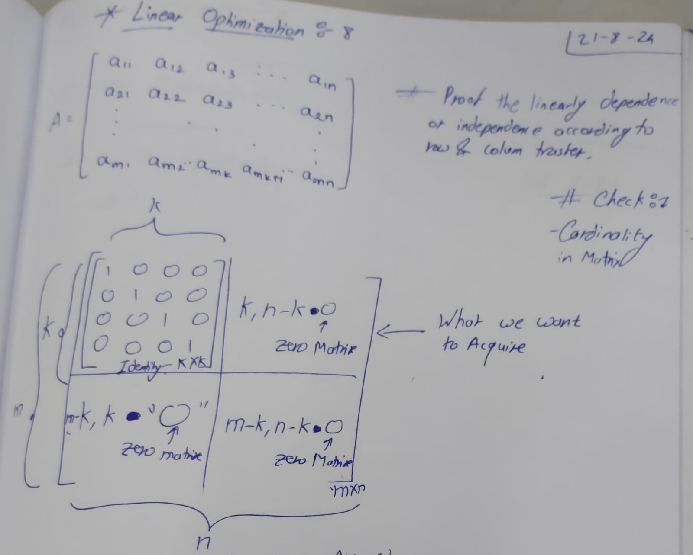

Links: [IIT Hyderabad](IIT%20Hyderabad.md)

# LO - 00

- Nothing

# LO - 01, 02

- Grade Details & How will be Curriculum
## Linear Optimization

- **Meaning:** A mathematical method for finding the best outcome (maximum or minimum) in a model whose requirements are represented by linear relationships.
- **Key Characteristics:**
  - **Objective Function:** The function to be maximized or minimized.
  - **Constraints:** Linear inequalities or equations that limit the possible solutions.
  
**Example:**
- **Maximizing Profit:** Determining the best mix of products to produce to maximize profit given constraints like limited resources or production capacity.
## Matrix Theory

- Matrix theory helps in organizing and solving linear optimization problems efficiently.
- It uses matrices to represent linear equations and inequalities, making it easier to perform calculations and find optimal solutions.
  
 

# LO - 03

### Key Concepts
-  **Matrix Operations**:
   - **Addition**: Adding two matrices of the same dimension by adding their corresponding elements.
   - **Multiplication**: Multiplying two matrices where the number of columns in the first matrix equals the number of rows in the second.
   - **Transpose**: Flipping a matrix over its diagonal, switching the row and column indices of each element.
   - **Inverse**: A matrix that, when multiplied by the original matrix, results in the identity matrix (only for square matrices).

### Creating Products Through Raw Materials: Linear Optimization

1. **Objective Function**:
   - Define the goal, such as maximizing profit or minimizing cost, usually represented as a linear function.

2. **Constraints**:
   - Represent limitations such as available raw materials or production capacity. These are linear inequalities.

3. **Matrix Representation**:
   - Formulate the linear programming problem using matrices. The objective function and constraints can be expressed as matrix equations.

4. **Optimization**:
   - Solve the linear programming problem using methods like the Simplex method to find the optimal solution within the constraints.

### Process Overview

1. **Identify the Variables**: 
   - Determine what quantities you need to optimize (e.g., amounts of different products to produce).

2. **Formulate the Objective**:
   - Create a linear equation that represents the goal (e.g., maximize profit).

3. **Set Up the Constraints**:
   - Identify the limitations (e.g., limited raw materials) and express them as linear inequalities.

4. **Matrix Formulation**:
   - Translate the objective and constraints into matrix form.

5. **Solve**:
   - Use an optimization method to find the best solution that satisfies all constraints.

### Tabular Method (for Boolean Functions)
The **Tabular Method**, also known as the **Quine-McCluskey Algorithm**, is used for simplifying Boolean functions. It systematically reduces a Boolean expression to its simplest form, similar to how Karnaugh maps are used.

#### Steps in the Tabular Method:
1. **List Minterms**: Start by listing all minterms of the Boolean function that correspond to the output "1".
2. **Group Minterms**: Group the minterms by the number of 1s in their binary representation.
3. **Compare and Combine**: Compare minterms in adjacent groups (groups differing by only one 1 in their binary representation) and combine them if they differ in only one bit position, marking the difference with a dash `-`.
4. **Prime Implicants**: Continue combining until no further combinations are possible. The resulting expressions are called prime implicants.
5. **Prime Implicant Chart**: Construct a chart with prime implicants and minterms, identifying which implicants cover which minterms.
6. **Select Essential Prime Implicants**: Identify essential prime implicants (those that cover a minterm not covered by any other prime implicant).
7. **Minimized Expression**: Combine the essential prime implicants to form the simplest Boolean expression.
#### Example Problem for Tabular:

- **Problem:** Simplify the Boolean function f(A,B,C)=∑m(1,3,7)f(A, B, C) = \sum m(1, 3, 7)f(A,B,C)=∑m(1,3,7), where m m m denotes the minterms.
- Minterms: m(1)=001, m(3)=011, m(7)=111.

### Simplex Algorithm (for Linear Programming)
The **Simplex Algorithm** is a popular method for solving linear programming problems, which involve optimizing (maximizing or minimizing) a linear objective function subject to linear equality and inequality constraints.

#### Steps in the Simplex Algorithm:
1. **Convert to Standard Form**:
   - Express the problem in standard form where all constraints are equalities, and all variables are non-negative.
   - Add slack variables to convert inequalities to equalities.

2. **Set Up Initial Simplex Tableau**:
   - The simplex tableau is a tabular representation of the linear programming problem.
   - It includes the coefficients of the variables in the objective function and constraints.

3. **Identify the Pivot Element**:
   - The pivot element is selected from the tableau to improve the solution. 
   - It is chosen from the column with the most negative indicator (for maximization problems) and the row that allows the smallest positive ratio of the right-hand side to the pivot column value.

4. **Pivot Operation**:
   - Perform row operations to make the pivot column a unit column (i.e., it has 1 in the pivot row and 0s elsewhere).
   - This step moves to a new basic feasible solution in the search space.

5. **Check for Optimality**:
   - If all the indicators (in the objective function row) are non-negative (for a maximization problem), the current solution is optimal.
   - If not, repeat the process by selecting a new pivot element.

6. **Obtain the Solution**:
   - Once the optimal tableau is reached, the solution can be read from the tableau.
   - The values of the decision variables correspond to the right-hand side values in the final tableau.

#### Example Problem for Simplex:
Maximize \( Z = 3x_1 + 5x_2 \)
Subject to:
$$[
x_1 + 2x_2 \leq 6
]$$
$$[
2x_1 + x_2 \leq 8
]$$
$$[
x_1, x_2 \geq 0
]$$

The Simplex Algorithm helps in finding the values of \(x_1\) and \(x_2\) that maximize \(Z\) under the given constraints.

### Comparison:
- **Tabular Method** is used for minimizing Boolean expressions, useful in digital logic design.
- **Simplex Algorithm** is used for solving linear programming problems, useful in optimization problems across various fields like operations research, economics, and engineering.

# LO - 04

## Basic Operations on Matrices
1. **Row Exchange**: Swap rows in the matrix.
2. **Column Exchange**: Swap columns in the matrix.
3. **Multiply by Non-Zero Constant**: Multiply a row or column by any non-zero constant.
4. **Row Addition**: Update row ( R_i ) using another row ( R_j ):
   - $$( R_i \leftarrow R_i + \alpha R_j )$$
   - Here, $$( \alpha )$$ is a constant (Non Zero Element).

## Cross Elimination Method
- **Rank of Matrix**: The number of independent rows is equal to the number of independent columns.
  - **Rank** = Number of independent rows = Number of independent columns

- **Key Matrix Concepts**:
  - **Independent Rows**: Rows that cannot be formed by a linear combination of other rows.
  - **Independent Columns**: Columns that cannot be formed by a linear combination of other columns.

## Matrix Operations
- **Row Operations**: Include row exchange, multiplying by a constant, and adding multiples of other rows.
- **Column Operations**: Include column exchange, multiplying by a constant, and adding multiples of other columns.

## Practical Application
- Use these operations to simplify matrices and solve linear systems.
- The rank of a matrix helps in determining the solution of linear equations and the consistency of systems.

# LO - 05

## Vector Space
- A vector space \( V ) over a field Real Number ( R ) (or any field) is a set of vectors that follows specific laws.

### Vector Space Laws
1. **Associative Law**: $$( (u + v) + w = u + (v + w) )$$
2. **Identity Element**: $$\mathbf{v} + \mathbf{0} = \mathbf{v} $$
3. **Inverse Element**: $$( \mathbf{v} \in V ),\;\;\; there exists ( -\mathbf{v} ) such that ( \mathbf{v} + (-\mathbf{v}) = \mathbf{0} )$$
4. **Commutative Law**: $$( \mathbf{u} + \mathbf{v} = \mathbf{v} + \mathbf{u} )$$

### Scalar Multiplication Laws
1. **Multiplication by 0**: $$( 0 \cdot \mathbf{v} = \mathbf{0} )$$
2. **Multiplication by 1**: $$( 1 \cdot \mathbf{v} = \mathbf{v} )$$
3. **Identity Multiplication**: $$( \alpha \cdot (\beta \cdot \mathbf{v}) = (\alpha \beta) \cdot \mathbf{v} )$$
4. **Distributivity of Vector Sum**: $$( \alpha \cdot (\mathbf{u} + \mathbf{v}) = \alpha \cdot \mathbf{u} + \alpha \cdot \mathbf{v} )$$
5. **Distributivity of Scalar Sum**: $$( (\alpha + \beta) \cdot \mathbf{v} = \alpha \cdot \mathbf{v} + \beta \cdot \mathbf{v} )$$
6. **Associativity of Scalar Multiplication**: $$( \alpha \cdot (\beta \cdot \mathbf{v}) = (\alpha \beta) \cdot \mathbf{v} )$$

## Subspace

$$U\subseteq V$$
- A subspace ( U ) of ( V ) is a subset of ( V ) that is itself a vector space.

## Linear Dependence and Independence
- **Definition 1**: Vectors ( v1, v2, .. vn )are linearly dependent if there exist scalars \( \alpha_1, \alpha_2, ...., \alpha_n \in \mathbb{R} \) (not all zero) such that:
$$  [
  \alpha_1 \mathbf{v}_1 + \alpha_2 \mathbf{v}_2 + \cdots + \alpha_n \mathbf{v}_n = \mathbf{0}
  ]$$

- **Definition 2**: Vectors (v1, v2, ...., vn) are linearly independent it they are not linearly dependent of there alpha1, alpha2, ..., alpha n /epsilon R.
$$d_{i} = 0, \forall $$

- **Definition 3**: Vectors (v1, v2, ...., vn) from vector space \( V \) form a basis if:
  1. They are linearly independent.
  2. Every vector \( w \in V \) can be written as:
  3. $$ [
     \mathbf{w} = \sum_{i=1}^n \beta_i \mathbf{v}_i
     ]$$

## Additional Notes
- Adding a new vector w to a set of vectors in \( V \) can change the set from independent to dependent.

# LO - 06

## 1. **Basics of Linear Optimization**
Linear Optimization, also known as Linear Programming (LP), involves finding the maximum or minimum value of a linear objective function, subject to a set of linear constraints. The solutions to these problems lie within a feasible region defined by the constraints.

### Key Terms:
- **Objective Function**: The function you want to maximize or minimize, typically in the form `O = c1x1 + c2x2 + ... + cnxn`.
- **Constraints**: Linear inequalities or equations that define the feasible region, e.g., `a1x1 + a2x2 + ... + anxn ≤ b`.
- **Feasible Region**: The set of all points that satisfy the constraints.
- **Optimal Solution**: The point in the feasible region that maximizes or minimizes the objective function.

## 2. **Basis (B1, B2) and Intersection**
In linear programming, a **basis** is a set of linearly independent vectors that span the space where the solution lies. The bases are often denoted as `B1`, `B2`, etc.

### Basis Explanation:
- **B1** and **B2** represent two different bases, each consisting of vectors that can span a part of the solution space.
- The intersection of two bases, `B1 ∩ B2`, consists of the common vectors shared by both bases. This intersection might represent a subspace common to both bases.

### Example:
- Consider two bases `B1` and `B2`:
  - `B1 = {w1, w2, ..., wk, vk+1, vk+2, ..., vm}`
  - `B2 = {w1, w2, ..., wk, uk+1, uk+2, ..., un}`
  - The Intersection, It represent subspace shared by both bases.
    $$B1 \cap B2 = K$$

## 3. **Linear Combinations and New Vectors**
A vector `Vk+1` can be expressed as a linear combination of other vectors, including those from a different basis.

### Example:
- $$V_{k+1} = b_{1}w_{1} + b2w2 + ... + b_{K}w_{K} + bk+1uk+1 + bk+2uk+2 + ... + b_{n}U_{n}$$
- Here, the coefficients `bk+1, bk+2, ..., bn` represent the contribution of each vector from `B2` in forming `Vk+1`.
- For `Vk+1` to be a new vector, at least one of `bk+1, bk+2, ..., bn` must be non-zero.

## 4. **Objective Function (O)**
The objective function in linear optimization often looks like this:

$$O = (\alpha_1 - P1)Z1 + (\alpha_2 - P2)Z2 + ... + (\alpha_n - Pn)Zn$$

### Explanation:
- **Z1, Z2, ..., Zn**: Decision variables.
- **alpha1, alpha2, ..., alphan**: Coefficients representing the benefit or cost per unit of each variable.
- **P1, P2, ..., Pn**: Prices or costs associated with each variable.

The goal in linear optimization is to find the values of `Z1, Z2, ..., Zn` that maximize or minimize `O`, subject to the given constraints.

# LO - 07

# LO - 08

# LO - 09 / 10 / 11

 Unknown
 
---
