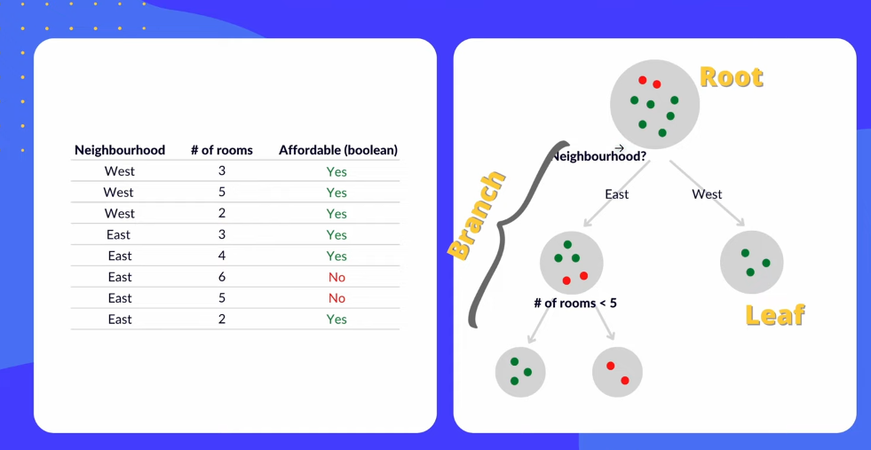

## Implementing Decision Tree

- **If it classifies into category -> Classification tree**
- **If it predicts numeric values -> Regression tree**

### Process

- When we get dataset we divide that in training data & testing data.
- Calculate information gain with each split & until stopping criteria is reached
- If leaf node is pure then it's great & If leaf node is not pure then we check for majority vote.
- Information Gain:
	- IG = E(parent) - [ weighted average ] * E(children)
	- E = Entropy (Any disorder (Not pure node))
	- $$E = - \sum p(X).\log_{2}(p(X))$$
	- $$ p(X) = \frac{no(x)}{n}$$
	- Stopping Criteria : Maximum depth, minimum number of samples, min impurity decrease.