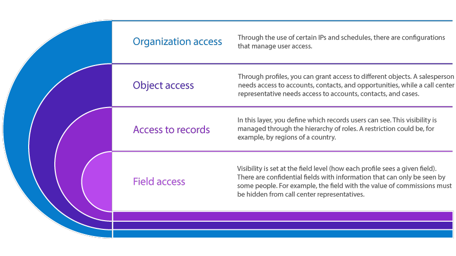

# [[Salesforce]] Admin Notes

**Programming Technologies Salesforce:**

1. Lightning Component Framework : UI Development framework
2. Apex : Salesforce language for programming
3. Visualforce : Markup Language (.vfp)

**Salesforce Edition** 

[Salesforce Feature per Edition link](https://help.salesforce.com/s/articleView?id=sf.overview_limits_general.htm&type=5&language=en_US)
>

**Relationship types:**

1. Master-Detail Relationship : Like inheritance, if parent object deleted than child object will also delete (cascade delete).
2. Lookup Relationship : Same as MD but without cascade delete. Inherited record don't get affected even if parent data is changed.

---

## Info

**Multi-Tenant Architecture :** Single DB for Multiple Clients.  
**Meta-Data Architecture :** Store Pages Layout (Accounts, Leads, Contacts).

**App exchange** same as Playstore we can create App & Publish/Sale your app using app exchange.  
Standard App are inbuilt app of salesforce & Custom app which we create.  

> We store data on Objects (like table).  
> Fields are like columns with different datatype.  
> Records are like all info & Values of User (like Row).
  
* **Validation Rule :** Validation rule contain error detection formula so if validation rule detect something than generate error.
* Validation Rule : check entered data & if data makes the validation syntax (error condition formula) true then it will throw error (validation msg) (useful for data restriction)  
* We can also use REGEX values in validation rule syntax 
  (E.g.. Enter valid Phone No. ( REGEX(Phone, "\\D*?(\\d\\D*?){10}")) )  
* We can use 1 Profile to assign it to multiple Users.
* Roles we can use for roles hierarchy.
* Trigger.new : for New Data & Trigger.old : for Old Data.

**Storage Types :**
1. File Storage - Salesforce File & Custom Files.
2. Data Storage - Object, Data & Metadata. 

**To create Apex class, Triggers, Visualforce Page, components we can use :**

1. Developer Console
2. Notepad Editor
3. Inline Editor (Can see the edited output result)

---

## Access
> 

- **Org Access:** IP Range/Login hrs.
- **Object Access:** Control Profile Access/R/W permissions, Permission Set.
- **Record Access:** Role Hierarchy, Sharing Rule, Manual Sharing, OWD.
- **Field Access:** Field Level Control & Accessibility.

**Profiles:** User can access only the things which there profile allows. Profile are mandatory to access any object, field or other permission needed things. One User can have only one profile & through profile we can set all permissions.

**Permission Set:** They are used to give extra permission at User Level. They are not Mandatory. Multiple User can have same permission set & One User can have multiple permission set.

**Sharing Rules:** Use sharing rules to extend sharing access to users in public groups, roles, or territories. Sharing rules give particular users greater access by making automatic exceptions to your org-wide sharing settings.

**Sharing Model**  
>
---

## Automation Tools Salesforce:
>[Flows, Workflow Rules, Process Builder Info Link](https://www.manras.com/salesforce-flow-vs-process-builders-and-workflow/)

1. Process Builder (Retiring)
2. Workflow Rules (Retiring)
3. Flows (Active)

**Interactive Experience Automation**:  
- Screen Flow
- AutoLaunched Flow
- Approval Process
- Lightning Components
- Visualforce Page

**Background Process Automation**:  
- Record Triggered Flow
- Schedule Triggered Flow
- Platform Event Triggered Flow
- Apex Code
  
## Salesforce Details:

- Company setting has all the information about the company and all licenses & things.
- [User Interface Setting](https://help.salesforce.com/s/articleView?language=en_US&id=sf.customize_ui_settings.htm&type=5) - Control features of how user interact with ui.
- If we set multi currency in salesforce then we can’t disable it later.
- My Domain helps in custom login page, custom login policy, single sign on & other third party login methods & also control policies, security stuff.
- App menu easy way to control visibility of app in salesforce
- App manager info about each app & greater customization controls, utility items, navigation items, branding changes, profiles access.
- In App Guidance - it allow us to guide user using different popup msg ways.
- List Views - list which we can customize using filters & fields to display, its available in 3 variations list view ,split view & kanban view.
- We can add multiple users using Add Multiple User (up to 10 users) or Data Loader (More than 10 users).
- In the user record overview we can do user related tasks such as unlocking users, freezing users and deactivating users. (User Delete not possible)
- User license (sets the baseline features as user can use), permission set license (for access to variety of tools & function) & feature license (for access of additional features).
- To access object we use tabs & bunch of this tabs are used in application & they can be accessed by profiles (profile control visibility of app)
- Delegated Administrator grants user admin access for some time (to share admin duties for some time)
- Login as any user (It can be helpful for admin to exp exactly what particular user is facing by login as that user) (Go to Login access policies & allow this option then login by going to users section as any user)
- Setup audit trail -  Used to check any salesforce metadata (any backend config) changes in our salesforce org (last changes to org (logs))
- Salesforce Path - its component in which we see the progress of current task and at the end we will see closed won or closed lost for opportunity.
- Actions - Global Action & Record Action (Object specific action) (easy way to do things (check google IMG))
- Opportunity splits - Used to split revenue credit for opportunities. (If multiple people (Team) working on same opp then after closed won it will split credit as set values (total of splits do not need to add up 100%))
- Quotes - They are basically like template on which we can add extra sales details. & opportunity can have multiple quotes but only 1 quote will synced to opportunity. (Quote Template, Quote PDF)
- Multiple things are by default disable so we have to enable it to use it.
- Lead Scoring - Score a Lead based on Criteria.
- Einstein Lead Scoring - Uses AI to Score leads based on company successful conversion pattern. (Score 0 to 99)(Use Org Model or Global Model)
- Einstein Opportunity Scoring - AI to score opp based on your successful conversion patterns in company. (Score 0 to 99)(Use Org Model or Global Model)
- Opportunity Team Selling - Used when multiple users of team want to work on same opportunity. (It's required for Opportunity Split)
- System Admin - Have Acess to all records.
- Contact Roles in Opp - It's used to link Contact roles to opportunity.
- Lead Queue - It's holding area for leads until they are assigned owner. While creating Lead Queue we can give its access as per users, Public Groups, Roles...
- Lead Assignment Rules - Automatically assign leads to users or queues based on criteria we define.
- Web to Leads - Leads are created from online forms. (Can also use reCaptcha to reduce Spam)
- Campaign - Used to Track Marketing Efforts.
- Campaign  Influence - Used to Track Impact of Campaign 
- Data Import Wizard - Used to Import Data.
- Data Loader - Used for Both Import & Export Data. (Mostly Export)
- Macros - Users can run macros to complete repetitive tasks—selecting an email template, sending an email to a customer, updating the case status—all in a single click. A macro is a set of instructions that tells the system how to complete a task.
- Single Sign On (SSO) - Even if we click on forgot password for resetting password admin is required, directly by user not happen.

## Security:

- Salesforce start with very restrictive access & we open up the access using various features
- Trusted IP Address - Allow users to login without any verification request or challenges.(In Network Access section)
- Login IP range, Login IP Hours can control access in org (In Profiles Section)
- Password Policies - Configure length, expiry date, complexity of passwords & many other things. Can be set at profile lvl or organization lvl.
- Identity Authentication / Device Activation - Allows to control when and how users are prompted to verify their identity.e.g.  Like allowing Multi Factor authentication. (In history we can also see how users verified their identity)
- Session Settings - Used to config users sessions settings such as time until timeout and session security.(In Identity verification section & its own)
- Security health check - rating of how good standard security in salesforce org with current config (we can also fix using fix button (there are different sections of config details))
- 3 layers of access -  object access, record access, field access.
- CRED Access - Create, Read, Edit, Delete.
- Object Access - Control what object user can see (In Profile section)(Tab Hidden- can’t see field, Default off - can search and access it, default on - present in navigation bar every time)
- By going in Standard Object Permission of profile we can control CRED access permission for fields.
- Record Access - Control which records users have access to and their level of access (OWD, Role Hierarchy, Sharing Rules, Manual Sharing, Team Access).
- Sharing Settings - Most restrictive baseline of access, It contains Sharing rules of 2 types owner based sharing rule & criteria based sharing rule.
- Manual Sharing - We can manually share records with anyone.
- Team Access - Enable Teams & it will allow to view the record of users of teams.
- Field Level Security / Access - Which field user can access. (In Profile Section (Read access & Edit access)) or we can also use Set Field-Level Security (Visibility / Read only) by going to the object then the field section.
- Org Wide Default - most restricted then by going in a sharing setting we can access the OWD access. It can not overrule over profile access. & record access can only be opened up & can’t be restricted.
- Roles & Roles Hierarchy - effective way for record access & through sharing settings we can enable or disable it for custom objects (not standard object). High level roles will have access to all low level role records. & it can’t overwrite / override profile settings (if profile setting does not give access to a specific object then it will not be visible even if the user is on a higher level in hierarchy then other users who have access.) & it will not overrule if users have specific CRED permissions.
- Manual sharing / Sharing Rules - (Sharing rule - max 300 Owner based or max 50 Criteria Based). (Manual sharing -  Record by record basis & give access with read only / edit ). In the sharing rule all records will be shared as per settings.
- Public groups - way of sharing records with groups of users who are not normally grouped together. We can add the roles, profiles, territory & records in profile groups and everyone in the profile group will have shared records.
- Teams - 3 types of teams- Account teams, opportunity teams, case teams. Go to setup and search teams. So basically we can add specific members in the account team for each account & give them access to account View/ Edit & their child cases/opportunities.
- Profile - One and only profile to each user. & standard profile can not be edited we can clone them and create custom ones. We can activate enhanced profile interfaces from User management settings. Very important for access management & permission sets can  be used to grant more access.
- Permission Sets - Used to grant more functionality to users than their profile permits. New permission set is very restricted then we open up as per our requirement.
- Permission set group - Its group of permission sets which we can assign to users rather than doing it manually for each permission set. We also have muted permission set so if we don’t want our assigned user to do some tasks of which was previously granted by permission set then we can create muted permission set which will mute the thing so assigned user will not be able to do it (removing permission granted by permission set group by using muted permission set).
- Validation Rule will be first process to execute. (Don't Apply if Quick Create Used.)
- Recurring Tasks - In Salesforce we can enable Recurring Tasks & then we can set a task to repeat as per our requirement.

## Objects:

- Standard Object- Can not be deleted but can be renamed or hidden. They normally come with standard fields.
- Custom Object - either from SpreadSheet or Standard. We can use a custom tab if we forget to create a tab at the time of the custom object.

### Opportunities:  
It's used to track and manage your potential deals with salesforce opportunities.

### Sales Process (Path for Opportunity):  
The Process Opportunity goes through…  
e.g. B2B, B2C, Tender (reflect in opp stage field)  
We can assign sales process by selecting it in record types of opportunities.  

### Forecases: 
Used to predict future sales revenue and such things…  
Forecast 5 type: omitted, pipeline, Best Case , Commit, closed.  

### Orders:
Used to Track fulfilment of product and services.  
To create order we need to have contract.  
- Reduction Orders - Return / Cancellation of Order
- Negative Quantity Settings - Negative amount of products.
- Zero Quantity - Order with Zero amount of products.
- others....

### Contracts:
Used to store information about a Contractual Agreement between Parties.
- Contract is Linked to Account (Required Field) & it also has its Status & Contract Term (Months Period) as required field.

### Products:
Used to represent Products or services sold.
- Can be linked to Opportunity, Quotes, Orders, etc.
- Product must have standard price set while accessing it with price book.
- It also has price book which store multiple products while linking.
- Price book determines at what price product will be sold at.
- When we set Products in Opportunity then it become Opportunity Line Item.

> **Product Scheduling**  
> Used for Payment and delivery cycles of products or services.  
> Quanitity Scheduling / Revenue Scheduling.

### PriceBooks:
Contains the Prices (Price book entries) that product should be sold at.
- 1 Standard PB & Multiple Custom Price Books.

### Leads:
Leads are potential Customers.
- Leads are then converted.
- On conversion Account and contact get created.
- leads can also create opportunity on conversion.

> **Lead Convert** - We can convert Leads with Account and Contacts & If there is genuine selling chance then we can also create opportunity for it.  
> 
> **Lead Mapping** - Where fields are mapped from Leads to Accounts, Contacts & Opportunity. Basically we choose after lead conversion which fields will be converted in those objects. Also need to create a custom field for other objects if mapping any custom field.

## Fields:
- Field data type can be changed for custom field only not standard field. there are some restrictions
- we can only delete custom field not standard field.

# Salesforce Relations:

> Relations are used to link records or objects with each other.  
> Schema builder is a good way to know the related objects in UI.  
> We can use Schema Builder to create new fields. We need to add a newly created field on the page using Page Layout & Schema Builder also show us the relationship between different objects using UI.  
> Using Lookup / MasterDetails relationship we can create associated records  
> One to Many & Many to many -> Lookup , Master Details Rel  
> Relation between External Object -> External Lookup, Indirect Lookup Rel  
> Only with USER Objects we have Hierarchical Relationship we use it for relating one user to another user.  

**Master Detail Relation**:
- Tight relationship - 1 to 1, 1 to many, many to many using Junction object (fix cascade delete) it have rollup summary feature
- max 2 MD relationship per object
- we create relationships on child/Detail objects.
- In MD relationship detail objects inherit security & sharing from masters object.
- Master always required while creating records in details object in MD but not needed in Lookup relationship.
- In MD Relationship the The Visibility & Sharing Setting of Parent object is inherited by child object.
- Many to many Relationship Two objects can be related when a record from one object has a relationship with multiple records of another object and vice versa.
- We can use Two Master Detail relationship to create many to many relationship between objects.
- In order to create many to many relationship we need Third Object Junction Object (It’s object with two Master Detail Relationship linked to both of our objects)

**Lookup Relationship**:
- Loose Relationship - 1 to 1,1 to many,Self,  External, Indirect, Hierarchical. (LR don't have rollup summary field).
- Max 40 in LR per object.
- Master is not required while creating child record.

**Extra Info**:
- External Objects - Similar to Custom Object but they map data outside of the salesforce Org (Data source outside salesforce). We need to form connection for the data table to access the data & we can define the access type as well. Using External Data is actually good if we have a huge amount of data & we only use small amounts of data to work with. External objects do not waste any storage & resources to keep data in sync. We access real time data.
- External Relationship -> External Lookup Rel (Parent Object always will be External Object, child can be External Object, Standard, Custom Object) & Indirect Relationship (Use to link Child External Object with Parent Standard or Custom Object)
- External ID’s :-> It's a field that contains a unique ID for external Data present outside of salesforce. (Identifier coming from external system) External ID field are indexed so they can be searched more quickly (only number, text & email fields can be external id)
- Create relationships at child objects in parent child relationships.
- we can create lookup then convert it master detail

## Record types:

- It will show different picklist values / Page Layout as per the record type assigned.
- Show Picklist values, Page Layouts, Business Process as per Record Type assigned.
- Page layout per record type per profile.
- object can have multiple record types
- record type access set by profile.

- Record Type will check only while data creation but after data is created the user can access data of all record types layouts and can modify it as RT work while data creation after that it will not control the data.

## Business Process:
we can select which process picklist are needed.
used to specify which picklist values are available to users based on the record types for 
- Lead Processes - lead
- Sales Process - opportunity
- Support Process - case.

## Lightning Application:

[//]: # (This are comments not visible on preview)
[//]: <> (Work on it...)

- Lightning Page -  App Page (1 pg for salesforce lightning & Mobile App) , Home Page (Lightning Experience Home Page), Record Page (when we see record info)

## Case Management Overview:

### Service Console: 
It's little change in UI where we can do our record changes quickly with help of UI layout. (Good for fast working)(have Split View)

### Case Overview:
Case is Customer service Issue. It help to track the Cases in Object.  
Support Settings hold many features which we can enable.  
We also have merge cases which are merged in related list location.  
Every case has unique case number.  
We also have Case Queue which can be created from queue. we can add case by changing owner to queue name.  
By Selecting Parent Case we can have case hierarchy.  
Case Team Roles - Teams with Read, Write permission selected.  (Set using predefined case Team)
Contact Roles - We can add multiple Contacts for case.

### Case Assignment Rules:
Automatically assign Case to users or queues based on criteria we define.

### Email to Case:

Cases can be created automatically from email sent to specific address.  
**Email to Case** - (Need Software & limited mails & Large Attachment Support)  
**On Demand Email to Case** - (No Software need & Higer mail limit & Smaller Attachment Size)  

### Web to Case:
Cases can be created from website form.

### Case Auto Response:
Automatically replies to Customers who raise the case. Different email as per the criteria.

### Support Processes:
It's Process through which Case goes through till being closed / Resolved.  
Support Processes are assigned to record types.  
We can specifically choose which status picklist values can we use and later on we assign it with record types.

### Escalation Rules:
Automatically reroutes a case and can notify a user or assign them to users/queues.  
We can also assign time like after 24hrs send notification & assign case to queue/user.  
We can also set business hours or start time & can monitor the potential Escalation.  

## Productivity & Collaboration:

### Activity Intro:
Activity come as Task, Events, Log a call, Emails.  
We see activity when we are watching any record (Used...).  
Activity Timeline is Important place where we can see all activity related info.

### Activity Settings:
It has it's own Object, so we can customize it as per our need.  
While Setting Tasks it has many options like repeat, time, & many more.  
Activity Settings holds features which we can enable as per need.  
We can also activate email tracking...

### Email Integration & Einstein Activity Capture:
There are various ways to Integrate Emails in Salesforce - Outlook, Gmail, Lightning Sync, Einstein Activity Capture.  
We basically can sync Emails, Events, Contacts, etc.  

### Chatter:
It's Twitter of Salesforce  
- Groups
- Approval Requests
- Out of Office
- Various Settings & Features

There are multiple settings for it in Chatter Settings.  
Chatter also has it's own licenses which we can use to gain or assign access of chatter.(Usually given to customers who want to connect on chatter)

### App Exchange:
It's Collection of Salesforce & Third Party add ons.
- Apps
- Bolt Solutions
- Flow Solutions
- Lightning Data
- Components

> **2 Type of Packages**  
> Managed - Created & Supported by Vendors - Non Customisable  
> Unmanaged - Not Supported or Upgraded - Customisable

Always Install app in Sandbox First before in Production Org.

## Data Importing & Exporting:

- For Import - Data Loader(external exe file software)(For Large Data 5 Million record)(support Repetitive & complex operations) / Data Import Wizard (Only limited Objects are present)(Present Inside Salesforce Org)(only up to 50K record)
- Data Loader -  After mapping the data & start for data import at the end we will receive two file success file (contain record which are imported) & Error file(records which are not imported with the reason) (validation rule also act here if validation rule is true then it will generate error & data will not get imported in salesforce org)(We can also update & upsert & delete our record from data loader, need ID for doing this operations )
- Data Loader - Export -> Export only Current Available / Visible records & ExportAll -> Export Current, archive, recycle bin records (all records)
- For Export - Data Loader(external exe file software) / Exporting data via reports(present inside Salesforce Org)
- Data Export Wizard -> We can schedule the data export for weekly and monthly basis (the time, start date & end date can be specified)

## Data & Analysis:

### Data:
Data Quality is Important.  
Duplicate Management.  
Managing Data - Data Import Wizard, Data Loader, Mass Tools.  
Salesforce Data Storage - Data Storage, File Storage & Big Objects.

### Data Import Wizard: 

Key Points:  
- Limited Object Supports
- 50K record Limit
- Insert, Update, Upsert Function.
- Duplicate Management 
- Validation Rules & Trigger will cross check
- No Downloader Required.
- Can only import csv.
- Admin & Users can use it.

### Data Loader: 

Key points:
- More Powerful
- all Objects supported
- 5 Million Record limit
- Import, Upsert, Delete, Hard Delete, Export & Export all Function (maybe undo as well)
- Can Schedule Data Jobs.
- No Duplicate Management
- Validation Rule, Workflow Rules & Trigger Fire.
- Only be used by Admin
- Software Download Required.
- Can only import CSV Files.
- Only Admin can use it.

### Record ID's & External ID's:

Record ID's  
- Record ID's Always going to be same.
- Record ID's will be unique.

External ID's  
- Used with Integrations
- External ID Checkbox when creating a Field.
- We can create it as field in Object with Text type & can set as Unique and Case Sensitive.

### Mass Tools:

Carry out action in Mass  
- Mass Delete.
- Mass Reassign Account Teams.
- Mass Reassign Opportunity Teams.
- Mass Reassign Approval Requests.
- Mass Transfer Records.
- Mass Update Addresses.

### Data Exports:

Data Backup / Data Export  
- Data Loader.
    - More Regular Exports Using CLI.
    - More Powerful.
- Data Export Service. 
    - Scheduled Export
    - One Month or Once a Week Limit

### Duplicate Management:

Protect Against Duplicate
- Matching Rule
  - Criteria to Cross check Matching / Duplicates.
  - Matching can be Fuzzy or Exact.

- Duplicate Rule
  - Thing to do if Duplicate Found.
  - Block or Alert User for Duplicate.

### Reports:

Collection of Records based on our Criteria.  
It can be Standard Report and Custom Report Type.  
Report only show values which user have access to.  
Report Folder can be modified as Public, Private & have there own access as per user permissions.  

- Standard Report Type
  - They can use Any Objects
  - normally use.
- Custom Report Type
  - It have 1 Primary Object & upto 3 Related Objects. 
  - It is More Complex.

> **Report Builder** used to easily customize Reports.  
> **Conditional Formating** - It need summary field with Grouping to use it. With Conditional Formating we can assign highlighting.  
> **Row Level Formula** - We use Formula & calculate based on record (Row) then receive the response value which we can view in column.(Max 1 in Report)  
> **Summary Formula** - We use Formula & calculate based on whole Group Opportunity & give reponse.  
> **Bucket Field** - Bucket field basically used to create bucket category which we can later on use to assign if value is High, Low, etc based on amount & can group by them.  
> **Subscribe** - Receive Copy of Report (Details) at specified criteria timing.  
> **Reporting Snapshot** - Need Custom Object to store Snapshot with Fields. It let us store set of records & their Data for future reference. Field Maping also needed here & can select how often snapshots will be taken. It's Used to report Historical Data & Spot Trends.

Report Formats
- Tabular Report - Column / Row Format.
- Summary Report - It has Grouping Rows with Tabular Report.
- Matrix Report - It has Grouping with Rows & Columns with Tabular Report & It also has Chart Feature.
- Joined Report - Reports of Reports biggest Report. We can add multiple Objects Blocks & Use there records in same Report.

### Dashboards:

Easy way to view Data in Summary like Reports.  
Dashboard will show results as per the user access permissions to data.  
We add Components based on present Reports & their data is used in component. We can customize Chart & show Data as per our requirement.  
Fixed Dashboard - View Same Data based on Specific User predefined. Data is visible as per present report data access.  
Dynamic Dashboard (Dashboard as Dashboard Viewer) - Dashboard show data based on viewer data.  

## Workflow / Process Automation:

Order of Execution:  
**Very Awesome Admins want Excellent People (VAAWEP)**  
- Validation Rules (Intial)
- Assignment Rules
- Auto-Response Rules
- Workflow
- Escalation Rules
- Processing / Flow Automation (At End)

Automatin Summary:  

- Workflow Rules
  - Simple Automation & we can also schedule it.
  - Sigle If then Statements way.
  - Enter Criteria : 
    - Created 
    - Created & every time Edited
    - Created & any time edited to subsequently meet criteria.
  - Workflow Actions :
    - New Task
    - New Email Alert
    - New Field Update
    - New Outbound Message (Send the Info to end-point service in XML format)
    - Select existing Action
  - Can only update it's object record or parent.

- Approval Process
  - Used when Record Needs to be approved.
  - Single If then Statements way.
  - It can consist series of steps for approval.
  - Once record sent to approval it can be edited by admin or other as per our settings.
  - Enter Criteria / Launched by:
    - Submit for approval
    - Multiple Criteria met
    - Formula evaluate to be true
  - Approval will receive email & Notification regarding approval request.
  - Actions :
    - New Task
    - New Email Alert
    - New Field Update
    - New Outbound Message (Send the Info to end-point service in XML format)
  - There can be Approval Actions or Rejection Actions.
  - Can only update it's object record or parent.
  - Approval Process in salesforce is an automated process that automates how salesforce records are approved in your org. AP is combination of steps for record to be approved / rejected either by user, queue or public group

- Process Builder
  - It's made up of multiple If this then do this type statements.
  - It can not send Outbound Messages.
  - Enter Criteria / Launched by:
    - Launched by another process
    - Platform Event Message.
    - Only when record created.
    - when record created or edited.
  - We set criteria every time & if it met then it will run immediate Actions.
  - Actions : There are multiple actions which we can perform (Outbound msg not present)
  - Can update any related Object records.

- Flows / Flow Builder (New Most Advanced Automation Tool)
  - Flows can be started by number of ways.
  - Flow work on Complex Logic.
  - Enter Criteria / Launched By:
    - Records Created
    - Records updated
    - Records deleted
    - quick actions
    - custom buttons
    - custom links
    - Process Builders
    - From Apex
    - by flows
    - platform events
    - others..
  - They can also be scheduled to run at specific times and can be set on custom tabs, lightning pages and visual force pages, and they can be triggered from there as well.
  - The actions that they can carry out can either run immediately or delayed, or they can even be resumed from post flows and the actions that are available to flows are numerous.
  - Actions : They have highest amount of Actions present which you can do.
  - Types Core :
    - Screen Flow
    - Record Triggered Flow
    - Scheduled - Triggered Flow
    - Platform Event - Triggered Flow
    - AutoLaunched Flow (No Trigger)
  - Can Update Any Object Records.