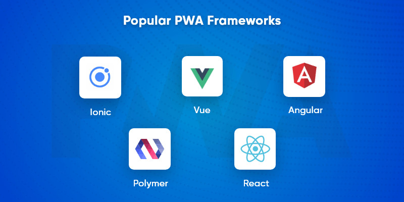

Progressive Web Apps (PWAs) are web applications that use modern web technologies to provide a user experience similar to that of native applications. They are designed to work on any platform that uses a standards-compliant browser, including both desktop and mobile devices.

Key features of PWAs include:

1. **Progressive**: They work for every user, regardless of browser choice, because they're built with progressive enhancement as a core tenet.
2. **Responsive**: They fit any form factor, such as desktop, mobile, tablet, or whatever is next.
3. **Connectivity Independent**: Enhanced with service workers to work offline or on low-quality networks.
4. **App-like**: They feel like an app with app-style interactions and navigation.
5. **Fresh**: They're always up-to-date thanks to the service worker update process.
6. **Safe**: Served via HTTPS to prevent snooping and ensure content hasn't been tampered with.
7. **Discoverable**: They're identifiable as "applications" thanks to W3C manifests and service worker registration scope.
8. **Re-engageable**: They can use features like push notifications to keep the user engaged.
9. **Installable**: Users can "keep" apps they find most useful on their home screen without the hassle of an app store.
10. **Linkable**: They can be easily shared via a URL and do not require complex installation.